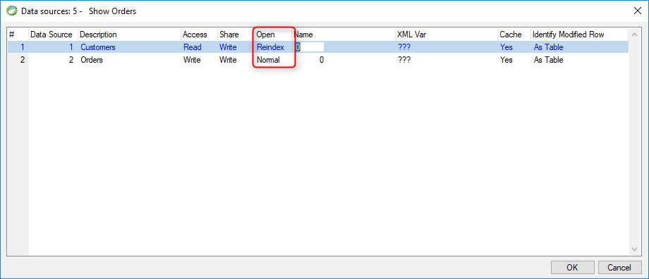

keywords: Datasource, Model , Table, Open, Normal, Reindex


Name in Migrated Code: **OpenMode**  
Location in Migrated Code: **Class** (in Model region)  



## Migrated Code Example 

Example:
```csdiff
internal readonly Models.Customers Customers = new Models.Customers
{ 
+        OpenMode = ENV.Data.DataProvider.BtrieveOpenMode.Normal
};
```  

## Property Values

| Magic Name | Migrated Code Name      |
|------------|-------------------------|
| Normal     | Normal                  |
| Reindex    | Reindex                 |

The default is Open = Normal in Magic

## Note :
Relevant only for Btrieve

