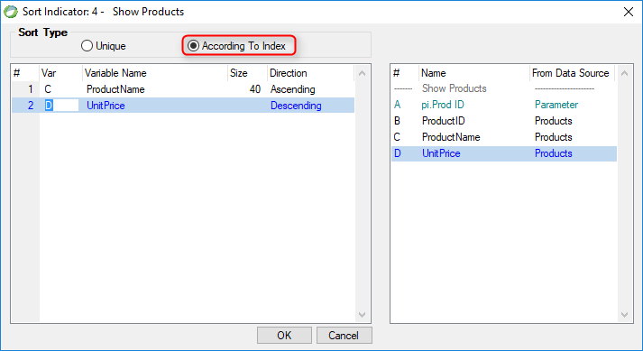

keywords: Task Properties, Sort, OrderBy, Unique

Name in Migrated Code: **OrderBy**  
Location in Migrated Code: **InitializeDataView method**  



## Migrated Code Example

```csdiff   
void InitializeDataView()
{
    From = Products;
    OrderBy.Add(Products.ProductName);
    OrderBy.Add(Products.UnitPrice, SortDirection.Descending);
+   OrderBy.Unique = true;
}
```  

## Property Values
True or false. The default is **false** when Sort type is According To Index

## See Also
* [UIController OrderBy Property](http://www.fireflymigration.com/reference/html/P_Firefly_Box_UIController_OrderBy.htm)  


