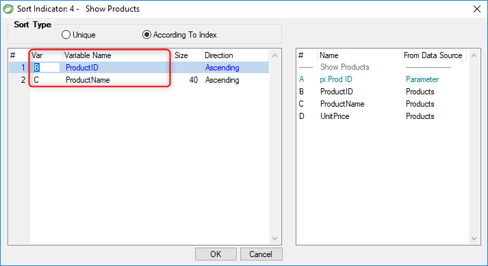

keywords: Task Properties, Variable , OrderBy.Add, Unique

Name in Migrated Code: **OrderBy.Add**  
Location in Migrated Code: **InitializeDataView**  



## Migrated Code Example

```csdiff   
void InitializeDataView()
{
    From = Products;
+    OrderBy.Add(Products.ProductID);
+    OrderBy.Add(Products.ProductName);
}
```  


## See Also
* [UIController OrderBy Property](/reference/html/P_Firefly_Box_UIController_OrderBy.htm)  
* [UIController Sorting Data](http://doc.fireflymigration.com/sorting-data.html)


