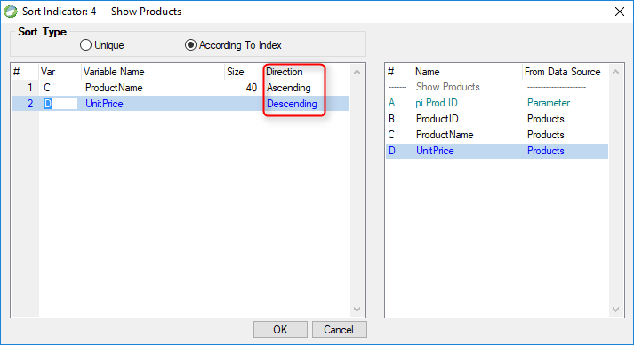

keywords: Task Properties, Sort, OrderBy, Unique

Name in Migrated Code: **SortDirection**  
Location in Migrated Code: **InitializeDataView**  



## Migrated Code Example

```csdiff   
void InitializeDataView()
{
    From = Products;
    OrderBy.Add(Products.ProductName);
+   OrderBy.Add(Products.UnitPrice, SortDirection.Descending);
}
```  

## Property Values
SortDirection.Ascending or SortDirection.Descending . The default is SortDirection.Ascending

## See Also
* [SortDirection Enumeration](/reference/html/T_Firefly_Box_SortDirection.htm)  
