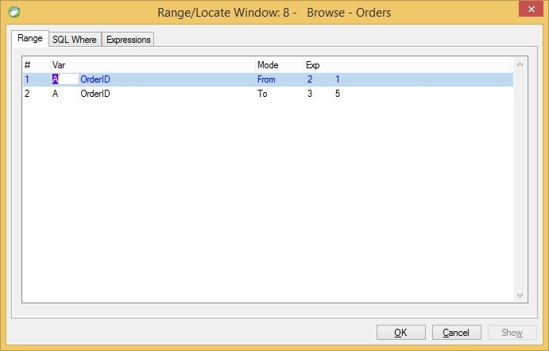

keywords: task properties, range, locate
# Range Tab
A screen shot of Magic's Range tab of the Range/Locate task properties appears below:

This tab represents the summary of the column range of the program,  
as explained is [this](http://doc.fireflymigration.com/column-range.html) and [this](http://doc.fireflymigration.com/filtering-data.html) articles.
