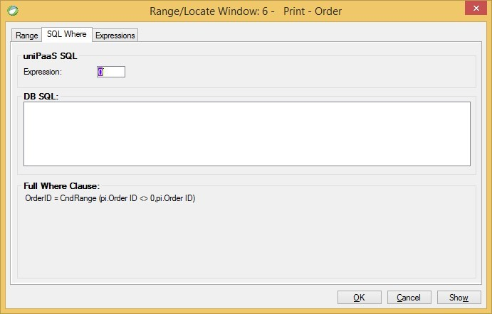

keywords: task properties, range, locate, SQL where, expression, DB SQL
# SQL Where
Name in Migrated Code: **Where.Add**  
Location in Migrated Code: **InitializeDataView**  



## Expression / DB SQL

The migrated code creates a phrase representing the migrated expression.

```csdiff
void InitializeDataView()
    {
        From = OrderDetails;
        Where.Add("{0} > 5 AND {1} > 0", OrderDetails.OrderID, OrderDetails.Quantity);
```


