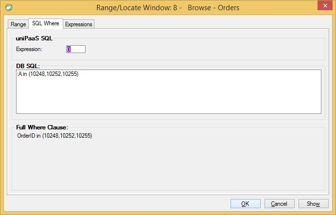

keywords: task properties, range, locate, SQL where, expression, DB SQL
# SQL Where
Name in Migrated Code: **Where.Add**  
Location in Migrated Code: **InitializeDataView**  



## SQL Where DB SQL

The SQL Where DB SQL allowed the developer to add an SQL Where statement using columns from the Data View.

```csdiff
void InitializeDataView()
    {
        From = Orders;
        Where.Add("{0} in (10248,10252,10255)", Orders.OrderID);
    }

```


