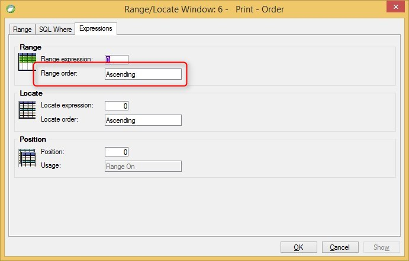

keywords: task properties, range, locate, SQL where, expressions

Name in Migrated Code: **OrderBy.Reversed**  
Location in Migrated Code: **InitializeDataView**  



Only in case where the *Range Order* is *Descending* this property will appear in the migrated code

## Example:
```csdiff
void InitializeDataView()
{
    From = OrderDetails;
    NonDbWhere.Add(() => OrderDetails.Quantity > 0);
+    OrderBy.Reversed = true;
```


