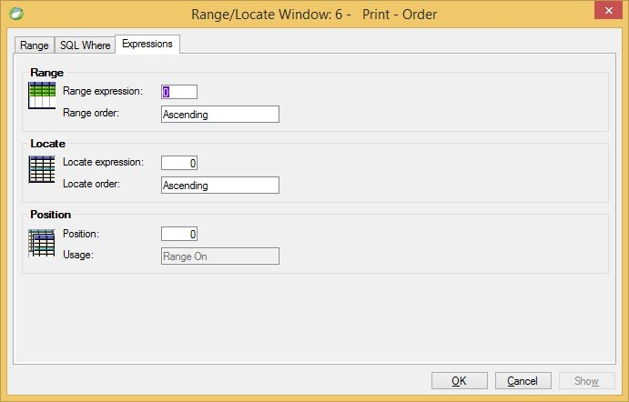

keywords: task properties, range, locate, SQL where, expressions
# Range / Locate Expressions
A screen shot of Magic's Range expressions tab appears below:

The following sections explain the equivalent of these properties in the migrated code.
