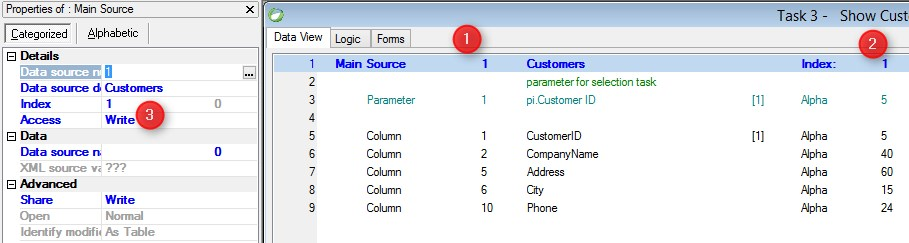

keywords: main,main source, main table
# Main Source

Name in Migrated Code: **From**  
Location in Migrated Class: **InitializeDataView**  



## Example:
```csdiff 
internal readonly Models.Customers Customers = new Models.Customers { AllowRowLocking = true };
```

```csdiff
   public ShowCustomers()
        {
            Title = "Show Customers";
            InitializeDataView();
        }
        void InitializeDataView()
        {
            From = Customers;
            OrderBy = Customers.SortByPK_Customers;
        }
```

1) The Main source - **From = Customers;**
2) The Source index - **OrderBy = Customers.SortByPK_Customers;**
3) Access source property - **AllowRowLocking = true;**

---
**See Also:**
* [UIController From](/reference/html/P_Firefly_Box_UIController_From.htm)
* [BusinessProcess From](/referencehtml/P_Firefly_Box_BusinessProcess_From.htm)

---