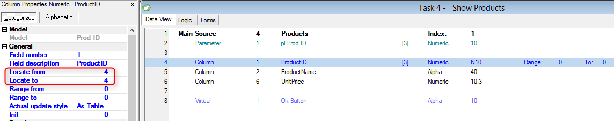

keywords: locate,startonrowwhere
Name in Migrated Code: **StartOnRowWhere.Add**  
Location in Migrated Class: **InitializeDataView**  



## Examples:

Products.ProductID - ProductID column from Products table<br>
pi_ProdID - Parameter


Locate From and To are equal
```csdiff
StartOnRowWhere.Add(Products.ProductID.IsEqualTo(pi_ProdID));
````

Locate To only
```csdiff
StartOnRowWhere.Add(Products.ProductID.IsLessOrEqualTo(pi_ProdID));
````

Locate From only
```csdiff
StartOnRowWhere.Add(Products.ProductID.IsGreaterOrEqualTo(pi_ProdID));
````

**See Also:**
* [Range-Locate](http://doc.fireflymigration.com/range-locate.html)
* [FilterCollection Class](http://doc.fireflymigration.com/reference/html/T_Firefly_Box_Data_Advanced_FilterCollection.htm)

