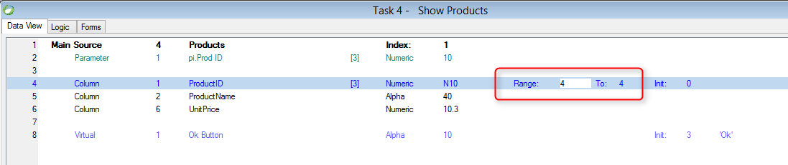

keywords: range,filtering data, where

Name in Migrated Code: **Where.Add**  
Location in Migrated Class: **InitializeDataView**  



## Examples:

Products.ProductID - ProductID column from Products table<br>
pi_ProdID - Parameter


Range From and To are equal
```csdiff
Where.Add(Products.ProductID.IsEqualTo(pi_ProdID));
````

Range To only
```csdiff
Where.Add(Products.ProductID.IsLessOrEqualTo(pi_ProdID));
````

Range From only
```csdiff
Where.Add(Products.ProductID.IsGreaterOrEqualTo(pi_ProdID));
````

**See Also:**
* [Range-Locate](http://doc.fireflymigration.com/range-locate.html)
* [FilterCollection Class](http://www.fireflymigration.com/reference/html/T_Firefly_Box_Data_Advanced_FilterCollection.htm)
