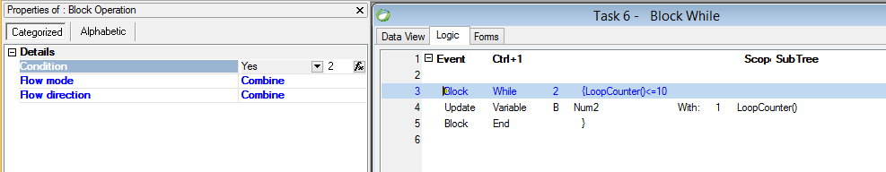

keywords: Block Loop, Block While



### Migrated Code Examples:

```csdiff
u.StartBlockLoop();
while(u.AdvanceBlockLoop() &&(u.LoopCounter() <= 10))
{
    Num2.SilentSet(Num2 + u.LoopCounter());
}
u.EndBlockLoop();
```