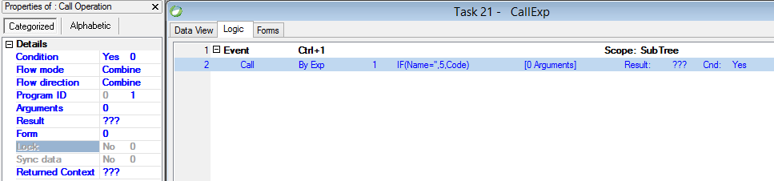

keywords: Call, Call Exp, Call ByExp, RunByIndex



### Migrated Code Examples:

```csdiff
Application.AllPrograms.RunByIndex(Exp_2());

 #region Expressions
 Number Exp_2() => u.If(TableB.Name1 == "B", 3, TableB.Code);
 #endregion

```
