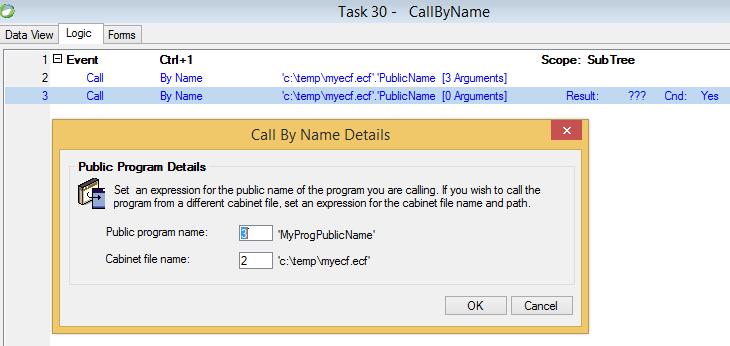

keywords: Call by name




### Migrated Code Examples:

**Simple Call by name**

```csdiff
 ApplicationControllerBase.RunProgramFromAnUnreferencedApplication(@"c:\temp\myecf.ecf","MyProgPublicName");

```

**Sending Argument**

```csdiff
 ApplicationControllerBase.RunProgramFromAnUnreferencedApplication(@"c:\temp\myecf.ecf","PublicName", TableB.Code, u.Trim(TableB.Name1));

```
