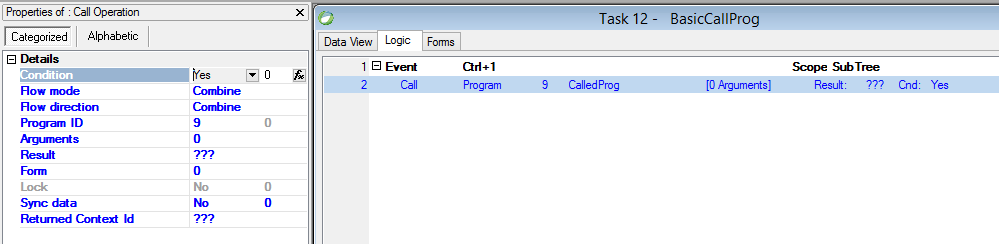

keywords: Call Program, Call Sub task 



### Migrated Code Examples:

**Simple Call program / Subtask**

```csdiff
new CalledProg().Run();
new SubTask().Run();
```

**Call program with Arguments**

```csdiff
new CalledProg().Run("AAA", v_Num1);

```


**Using Result**

```csdiff
var tempFormat = ReturnVal.Format;
ReturnVal.Format = "";
new CalledProg2().Run("AAA", 5);
ReturnVal.Format = tempFormat;
```

**Using Form**
```csdiff
new Browse_TableA().Run(view: new Views.CallForm(this));

```

**Using Lock**
```csdiff
 LockCurrentRow();
 Cached<CalledProg>().Run(TableA.Code);

```


See also:  
[LockCurrentRow Method for UIController](http://www.fireflymigration.com/reference/html/M_Firefly_Box_UIController_LockCurrentRow.htm)  
[LockCurrentRow Method for BusinessProcess](http://www.fireflymigration.com/reference/html/M_Firefly_Box_BusinessProcess_LockCurrentRow.htm)  


