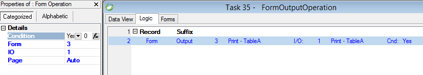

keywords: Form Output operation, Page, Printing,  




### Migrated Code Examples:

**Simple Form output**
```csdiff
protected override void OnLeaveRow()
{
    _layout.Print_TableA.WriteTo(_ioPrint_TableA);
}
```

**Form definition - Layout region**
```csdiff
#region Layouts
     Printing.FormOutputOperationC1 _layout { get { return Cached<Printing.FormOutputOperationC1>(); } }
#endregion
```

**Form Instantiation**
```csdiff
protected override void OnLoad()
{
     ioPrint_TableA = new ENV.Printing.PrinterWriter() { Name = "Print - TableA", PrinterName = Shared.Printing.Printers.Printer1.PrinterName };
     Streams.Add(_ioPrint_TableA);
}
```


**Using Page = Top**
```csdiff
protected override void OnLeaveRow()
{
     _ioPrint_TableA.NewPage();
     _layout.Print_TableA.WriteTo(_ioPrint_TableA);
}
```

**Using Page = Skip**
```csdiff
protected override void OnLeaveRow()
{
     if (_layout.Print_TableA.Height < _ioPrint_TableA.HeightUntilEndOfPage && !_ioPrint_TableA.NewPageOnNextWrite)
                _layout.Print_TableA.WriteTo(_ioPrint_TableA);
     else _ioPrint_TableA.EndCurrentPage();
}
```

#### See Also
[Reports](reports.html)

## Writing text files in .NET
This code represents the migrated code, when we write new code in .NET we'll rarely write text file access using the structure that was used in magic - instead we would simply read and write strings.

We recommend that you'll checkout the [Writing and Reading files](writing-and-reading-files.html) section of the documentation for more information.


