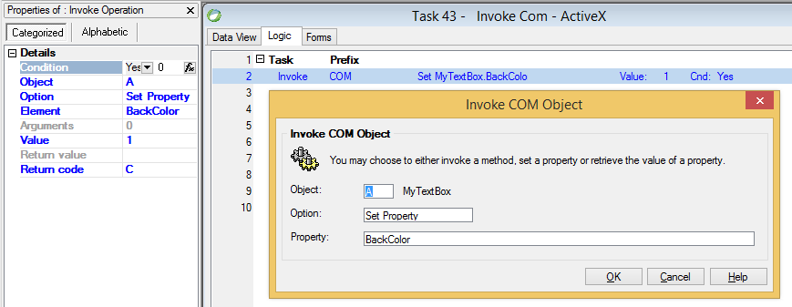

keywords: Invoke, Com, Call Com, OLE, ActiveX



### Migrated Code Examples:

**Column definition**
```csdiff
internal readonly ComColumn<Microsoft.Vbe.Interop.Forms.TextBox> MyTextBox = new ComColumn<Microsoft.Vbe.Interop.Forms.TextBox>("MyTextBox") 
{ CreateInstance = true, 
  InstanceType = typeof(Microsoft.Vbe.Interop.Forms.TextBoxClass) 
};
```


**Set Property**

```csdiff
Try(() => MyTextBox.Value.BackColor = 255);
```

**Use Return Value**

```csdiff
Try(() => MyTextBox.Value.BackColor = 255, v_ReturnCode);
```


**Get Property**

```csdiff
Try(() => myAlpha.Value = MyTextBox.Value.Text);
```


**Invoke Method**

```csdiff
Try(() => MyTextBox.Value.Copy());
```

**Invoke Method with Arguments**

The below code uses Documents.Add method of Word application com object to open a new document and sends 4 arguments
```csdiff
Try(() => 
{
    object Template = u.ToObject(@"c:\Word\MyTemplate.tpl");
    object NewTemplate = false;
    object DocumentType = 1;
    object Visible = true;
    Documents.Value = WordApp.Value.Documents.Add(ref Template, ref NewTemplate, ref DocumentType, ref Visible);
});
```

