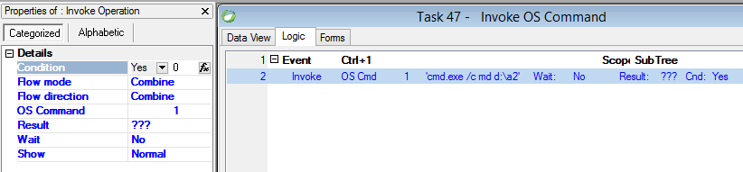

keywords: Invoke, Invke OS, Call OS, OS Command




### Migrated Code Examples:

```csdiff
 ENV.Windows.OSCommand(@"cmd.exe /c md d:\a2");
```

**Using Result**

```csdiff
 Result.Value = ENV.Windows.OSCommand(@"cmd.exe /c md d:\a2");
```

**Using Wait = Yes**
```csdiff
 Result.Value = ENV.Windows.OSCommand(@"cmd.exe /c md d:\a2", true);
```

**Using Show property**

```csdiff
//Hidden
ENV.Windows.OSCommand(@"cmd.exe /c md d:\a2", true, System.Diagnostics.ProcessWindowStyle.Hidden);

//Maximized
ENV.Windows.OSCommand(@"cmd.exe /c md d:\a2", true, System.Diagnostics.ProcessWindowStyle.Maximized);

//Minimized
ENV.Windows.OSCommand(@"cmd.exe /c md d:\a2", true, System.Diagnostics.ProcessWindowStyle.Minimized);
```
