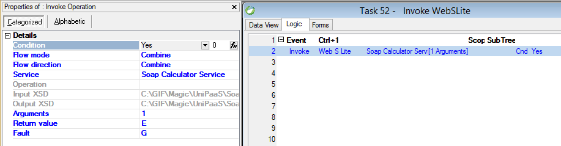

keywords: Invoke, Invke WebS Lite, Web service, lite



### Migrated Code Examples:


```csdiff
var wsResult = new Shared.WebServices.SoapCalculatorService().Run("http://tempuri.org/Add", XML_toSend, XML_Result);
Succes.Value = wsResult.Successful;
Fault.Value = Fault.FromString(wsResult.ErrorText);
```
