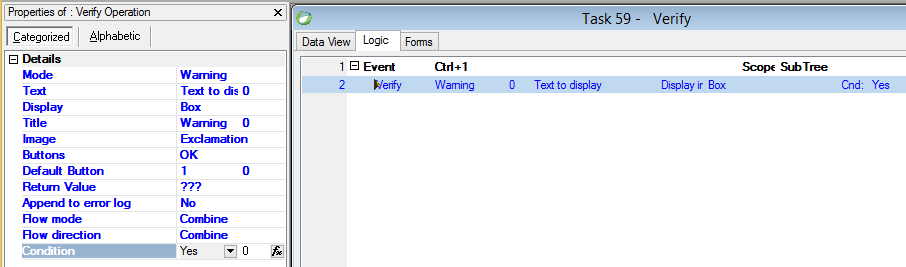

keywords: Verify, Error, Message box



### Migrated Code Examples:


\
**Warning**
```csdiff
Message.ShowWarning("Text to display as Warning in Box");
Message.ShowWarningInStatusBar("Text to display as Warning on Status");
```

\
**Error**
```csdiff
Message.ShowError("Text to display as Error in Box");
Message.ShowErrorInStatusBar("Text to display as Error on Status");
```

\
**Text as expression**
```csdiff
Message.ShowWarning("Good " + u.If(Time.Now < new Time(12,00,00), "Morning", "Afternoon"));
```

\
**Using Title**
```csdiff
Message.ShowWarning("Text", "New Title");
Message.ShowWarning("Text", "Date " + u.DStr(Date.Now, "DD/MM/YYYY"));
```

\
**Using Images**
```csdiff
Message.ShowWarning("Text", MessageBoxIcon.Question);

Message.ShowWarning("Text", MessageBoxIcon.Asterisk);

// Image = None
Message.ShowWarning("Text", MessageBoxIcon.None);
```

\
**Using Buttons**
```csdiff
Message.ShowWarning("Text", MessageBoxButtons.YesNoCancel, MessageBoxIcon.Question);
```

\
**Using Default button**
```csdiff
Message.ShowWarning("Text", MessageBoxButtons.YesNoCancel, MessageBoxDefaultButton.Button2);
```

\
**Using Return value**
```csdiff
vReturnValue.Value = Message.ShowWarning("Text");
```

\
**Using Append to error log**
```csdiff
Message.ShowWarning("Text", true);
```

\
**Full Sample**
```csdiff
vReturnValue.Value = Message.ShowWarning ("Text", "Warning", 
                                           MessageBoxButtons.YesNoCancel, 
                                           MessageBoxIcon.Question, 
                                           MessageBoxDefaultButton.Button2, 
                                           true);
```

