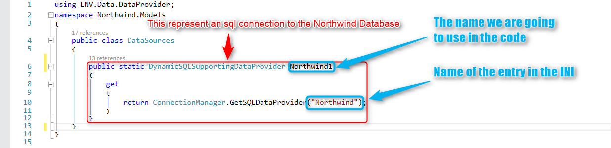

# Database Connections basic terms and concepts

In this article, and the next one, I am going to take you on a journey from the old and familiar to the new and exciting. By the end of this article, we are going to understand how to setup database connections and use it in our code.

## Database definitions in the ini, as were defined before the migration
First, we are going to start with the INI file, specifically in the [MAGIC_DATABASE] section:

```
[MAGIC_DATABASES]
Default Database = 1, , , , , , , , MagicRecordLock, ChangeFileInToolkit, +
CheckDefinition, CheckKey, FileLocks, , , , NoCheckExist, , ,
Btrieve = 22, Memory, , , , %ENVOYPATHS%, , , NoMagicRecordLock, ChangeFile+
InToolkit, CheckDefinition, CheckKey, NoFileLocks, , , NoCheckExist, +
NoCheckExist, 0, NoXATrans, NoXATrans, NoAS400SrvrSort,
Memory = 22, , , , , , , , NoMagicRecordLock, ChangeFileInToolkit, +
NoCheckDefinition, NoCheckKey, NoFileLocks, , , , NoCheckExist, , ,
Northwind = 21, Northwind, , , (local)\SQLExpress, , , , NoMagicRecordLock,+
 DontChangeFileInToolkit, CheckDefinition, NoCheckKey, NoFileLocks, , , , +
CheckExist, 0, , NoXATrans, NoAS400SrvrSort,
```
If we centralize our attention to the Northwind entry we can notice the following :


21 = SQL database (as specified in the DBMS section of the INI)  
Northwind = name of the database  
(local)\SQLExpress = name of the database server and so on. 

## New Database Connection
When creating a new database connection, you can still use that ini setting, but I find it combersome.

Instead you can add a connection from code, here's an example:
```csdiff
using ENV.Data.DataProvider;
...
public class Program
{
   public static void Init(string[] args)
   {
        ...
        ConnectionManager.Shared.AddMicrosoftSQLDatabase("Northwind", "northwind", @"(local)\sqlexpress");
   }
}

```
The `AddMicrosoftSqlDatabase` adds a database definition to the code and receives the following paramters:
1. Northwind - the name of the database that you'll use later in the `DataSources` class.
2. The catalog (database) name on the sql server.
3. The name of the server.
4. optional user name.
5. optional password.

There is a also a similar method called `AddOracleDatabase` for oracle, and `AddDatabase` for all other databases.

# Using these definitions in the DataSources class
The next step is to read the INI file – the Firefly platform is using the ENV.DATA.DataProvider.ConnectionManager.cs class to do so.  
The “ConnectionManager” is responsible for opening and closing the connection with the database.

Now we can use this information in the Models.DataSources.cs file :

```csdiff
using ENV.Data.DataProvider;
namespace Northwind.Models
{
    public class DataSources
    {
        public static DynamicSQLSupportingDataProvider Northwind1 
        {
            get
            {
                return ConnectionManager.GetSQLDataProvider("Northwind");
            }
        }
    }
}
```



We can see that the return value is “DynamicSQLSupportingDataProvider”, which means that this is a connection to an SQL database, rather than Memory, Btrieve, etc.

The property “getter” (get) asks the “ConnectionManager” class for a SQLDataProvider by the name of the entry in the INI file “Northwind”.

The next step is to use this as part of setting an entity in the application.
We need to setup the base connection of the entity :


