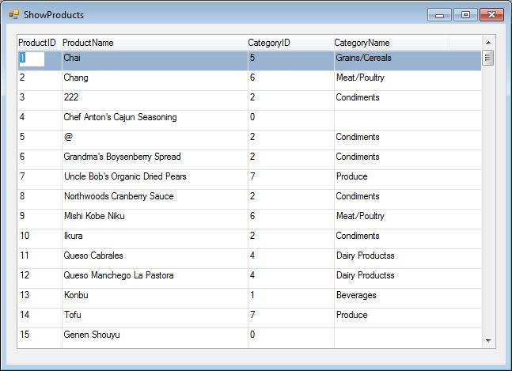

In this article we are going to review different types of Relations in your migrated code and their interaction with the database. We'll look at the difference between Find (Find, Insert if not found) and Join (Left Outer Join, Inner Join) as well as the different SQL code that each one generates. We will also discuss optimizing the SQL code for Relations, by using Cache. This article doesn't address Insert relation type and InsertIfNotFound relation types. To read more about these topics, and get code samples please see: [RelationType Documentation](/reference/html/T_Firefly_Box_RelationType.htm)

# Find Relation

To start with, we'll create a simple UIController, which will display a list of products and it's Categories.
```csdiff
    class ShowProducts : UIControllerBase
    {
        internal readonly Model.Products _products = new Model.Products();
        internal readonly Model.Categories _categories = new Model.Categories()
        {
            Cached = true
        };
 
        public ShowProducts()
        {
            From = _products; 
 
            Relations.Add(_categories,RelationType.Find,
                _categories.CategoryID.IsEqualTo(_products.CategoryID),
                _categories.SortByCategoryName); 
 
            View = new UI.ShowProductsUI(this);
        }
 
        public void Run()
        {
            Execute();
        }
    }
```
The .NET code displays this data on a form, as shown below:



Note that there are 15 lines on the grid displaying the first 15 lines from the Products Entity and a corresponding Category Name from the Category Relation. It is precisely this Category Relation that we will be looking at in this article in depth. As we progress, we will examine the SQL code for the Category Relation on each of these lines and understand the differences according to the Relation used and depending on whether Cache is enabled or not.

## Viewing the SQL

As a rule, a Relation is used to fetch related data from the database (or from Cache), for each row displayed in the grid. This rule applies whenever we enter a row, or whenever the values that define the Relation are changed (recompute). Now let's look into what goes on behind the scenes in the database, when we open this screen. The SQL code appears in the Output window. (For more details on the settings required to see SQL in the Output window, see: [View SQL Output](view-sql-output.html) ).

Let's examine the SQL code in the Output screen. Here is the generated SQL code, as shown in the Output window, for all 15 lines displayed on the grid:
```csdiff
ExecuteNonQuery - sp_cursorprepexec
 
Query Parameters:
@handle(Int32) = 
@cursor(Int32) = 
@paramdef(String) = 
@stmt(String) = 
SELECT ProductID, ProductName, SupplierID, CategoryID, QuantityPerUnit, UnitPrice, UnitsInStock, UnitsOnOrder, ReorderLevel, Discontinued 
FROM dbo.Products 
ORDER BY ProductID
@scrollopt(Int32) = 135170
@ccopt(Int32) = 8193
@rowcount(Int32) = 
 
ExecuteNonQuery Duration..: 37.0021
ExecuteReader - sp_cursorfetch
 
Query Parameters:
@cursor(Int32) = 180150003
@fetchtype(Int32) = 2
@rownum(Int32) = 1
@nrows(Int32) = 40
 
ExecuteReader Duration: 2.0001
ExecuteReader - 
SELECT CategoryID, CategoryName, Description 
FROM dbo.Categories 
WHERE CategoryID = 5
 
ExecuteReader Duration..: 34.0019
ExecuteReader - 
SELECT CategoryID, CategoryName, Description 
FROM dbo.Categories 
WHERE CategoryID = 6
 
ExecuteReader Duration.: 13.0007
ExecuteReader - 
SELECT CategoryID, CategoryName, Description 
FROM dbo.Categories 
WHERE CategoryID = 2
 
ExecuteReader Duration: 0
ExecuteReader - 
SELECT CategoryID, CategoryName, Description 
FROM dbo.Categories 
WHERE CategoryID = 0
 
ExecuteReader Duration: 7.0004
ExecuteReader - 
SELECT CategoryID, CategoryName, Description 
FROM dbo.Categories 
WHERE CategoryID = 7
 
ExecuteReader Duration: 0
ExecuteReader - 
SELECT CategoryID, CategoryName, Description 
FROM dbo.Categories 
WHERE CategoryID = 4
 
ExecuteReader Duration: 6.0004
ExecuteReader - 
SELECT CategoryID, CategoryName, Description 
FROM dbo.Categories 
WHERE CategoryID = 1
 
ExecuteReader Duration.: 12.0007
ExecuteReader - 
SELECT CategoryID, CategoryName, Description 
FROM dbo.Categories 
WHERE CategoryID = 0
 
ExecuteReader Duration: 0
```

Note: It is possible to see the above information within the context of a logfile, by defining the following in the ini file:

dblogfile = c:\temp\db.log

For further information regarding using logfiles, see : [Using Log Files](using-log-files.html)

---

## Analyzing the SQL

Let's review each and every part of the above statements.

### First statement

This statement declares a server side cursor. The cursor contains a select statement for the main table that returns all the rows from the Product entity, as displayed below:
```csdiff
ExecuteNonQuery - sp_cursorprepexec
 
Query Parameters:
@handle(Int32) = 
@cursor(Int32) = 
@paramdef(String) = 
@stmt(String) = 
SELECT ProductID, ProductName, SupplierID, CategoryID, QuantityPerUnit, UnitPrice, UnitsInStock, UnitsOnOrder, ReorderLevel, Discontinued 
FROM dbo.Products 
ORDER BY ProductID
@scrollopt(Int32) = 135170
@ccopt(Int32) = 8193
@rowcount(Int32) =
 
ExecuteReader Duration .. : 81.0046
```
### Second statement:

This statement fetches the data from the cursor that was just declared, as displayed below:
```csdiff
ExecuteReader - sp_cursorfetch
 
Query Parameters:
@cursor(Int32) = 180150003
@fetchtype(Int32) = 2
@rownum(Int32) = 1
@nrows(Int32) = 40
```

### Third statement

This statement reflects that the program code is fetching data from the database using a Select command. This statement is the first one directly referring to the Relation that we defined.
```csdiff
ExecuteReader - 
SELECT CategoryID, CategoryName, Description 
FROM dbo.Categories 
WHERE CategoryID = 5
 
ExecuteReader Duration..: 34.0019
```
As you can see, the program is fetching data from the Categories Relation table, where CategoryID is equal to 5. This is the Category id for the first row, as displayed in the grid screenshot above. This statement is followed by many more similar statements, that fetch Categories for each product row. We will demonstrate the following principle: The select statement for the Relation is executed for each row displayed on the grid and if Cache is applied (as it is in this case), rows that were already fetched are not fetched again.

---
# Using Cache

## Introduction

When working with Relation Selects, you can enable Cache in order to optimize the number of direct queries to the Database. Once enabled, The UIController will try not to refetch rows with Related data directly from the DB that have already been fetched, but rather, will check the Cache first and fetch from there if possible.

## Enabling Cache

To enable Cache either in the Entity or in the Task, Type “Cached = true” either in the Entity or the Task, as displayed below.

In the entity:
```csdiff
        public Categories() : base("dbo.Categories", "Categories", DataSources.Northwind1)
        {
             Cached = true;
        }
```
In the task:
```csdiff
        internal readonly Model.Categories _categories = new Model.Categories()
        {
            Cached = true,
        };
```
---
## Rules for Working with Cache

Even if you enable Cache, rows from a dB table will only be saved to the Cache if the following specific 3 conditions are met:

### Unique Sort

A unique sort was declared for the Relation. For example, here is a unique sort, as defined in the Categories entity:
```csdiff
        public readonly Sort SortByCategoryID = new Sort
        {
        	Caption = "CategoryID",
        	Unique = true 
        }
```
.. and here is the code that shows how the Relation declares this unique sort:
```csdiff
           Relations.Add(_categories,RelationType.Find,
                _categories.CategoryID.IsEqualTo(_products.CategoryID),
                _categories.SortByCategoryID);
```
### Use all Segments

All the segments of the unique sort must be defined in the Relation's Where clause. For example, the code for this unique sort defines only one segment, CategoryID, as shown below, which the Relation Where clause uses, thus in this example, the Relation is using all segments.
```csdiff
  void InitializeIndexes()      
  {
 
      SortByCategoryID.Add(CategoryID);
  }
```
If the unique index also included, let's say, the Category Name segment, then Category Name would also have to appear in the Relation code, in order for Cache to be enabled.

### Implicit Use of Primary key or other Unique Index

Even if the Relation does not use a specifically specified unique sort, if the Where criteria for the Relation match any of the unique indexes of the entity or it's primary key, Cache will still be applied. For example, the CategoryID columns is defined as the primary key of the Categories entity:
```csdiff
class Categories : Entity 
    {
        [PrimaryKey(Identity = true)]
        public readonly NumberColumn CategoryID = new NumberColumn("CategoryID", "N10", "CategoryID")
        {
        	DbReadOnly = true
        };
   };
```
Notes:

If the Select statement doesn't return any row, nothing will be saved to the Cache. As a result, any further use of the same Select statement will be directed to the database.  
Note that if the “CacheNonUniqueResults” property is set to true, then regardless of unique key or primary key definitions, Caching will be enabled. The usage is as follows:
```csdiff
        internal readonly Model.Categories _categories = new Model.Categories()
        {
             CacheNonUniqueResults = true
        };
```
--- 
## Applying the Cache Rules

Using our acquired knowledge, let's revisit the detailed SQL log displayed before.

### Cached = true

We can see that there are 8 Relation queries that the code generates, which return the required information for 15 rows on the grid. Thus, Cache saves 7 queries to the Database. To elaborate on this, let's reproduce the logic for each row:

- Product 1, Category 5 - Fetch the Relation from the dB.
- Product 2, Category 6 - Fetch the Relation from the dB
- Product 3, Category 2 - Fetch the Relation from the dB
- Product 4, Category 0 - Fetch the Relation from the dB.
- Product 5, Category 2 - Because the category was already fetched for product 3 and already exists in the Cache, no query to the DB is required.
- Product 6, Category 2 - Already exists in Cache
- Product 7, Category 7 - Fetch the Relation from the dB
- Product 8, Category 2 - Already exists in Cache.
- Product 9, Category 6 - Already exists in Cache.
- Product 10, Category 2 - Already exists in Cache.
- Product 11, Category 4 - Fetch the Relation from the dB.
- Product 12, Category 4 - Already exists in Cache.
- Product 13, Category 1, Fetch the Relation from the dB.
- Product 14, Category 7, Already exists in Cache.
- Product 15, Category 0 - Because no category was found when we asked for category 0 in product 4 - another query to the database is generated, in hope that a row will now be found.

### Cached = false

Now let's change the Cache to false, and see the result.
```csdiff
         internal readonly Model.Categories _categories = new Model.Categories()
        {
            Cached = false
        };
```
After running the UIController, we'll get the following result containing 15 full dB SQL references, which clearly shows that we now access the Database for each row, regardless of whether the CategoryID has already appeared:
```csdiff
ExecuteNonQuery Duration: 0
ExecuteNonQuery - sp_cursorprepexec
 
Query Parameters:
@handle(Int32) = 
@cursor(Int32) = 
@paramdef(String) = 
@stmt(String) = 
SELECT ProductID, ProductName, SupplierID, CategoryID, QuantityPerUnit, UnitPrice, UnitsInStock, UnitsOnOrder, ReorderLevel, Discontinued 
FROM dbo.Products 
ORDER BY ProductID
@scrollopt(Int32) = 135170
@ccopt(Int32) = 8193
@rowcount(Int32) = 
 
ExecuteNonQuery Duration...: 55.0032
ExecuteReader - sp_cursorfetch
 
Query Parameters:
@cursor(Int32) = 180150003
@fetchtype(Int32) = 2
@rownum(Int32) = 1
@nrows(Int32) = 40
 
ExecuteReader Duration..: 20.0011
ExecuteReader - 
SELECT CategoryID, CategoryName, Description 
FROM dbo.Categories 
WHERE CategoryID = 5
 
ExecuteReader Duration..: 27.0016
ExecuteReader - 
SELECT CategoryID, CategoryName, Description 
FROM dbo.Categories 
WHERE CategoryID = 6
 
ExecuteReader Duration: 0
ExecuteReader - 
SELECT CategoryID, CategoryName, Description 
FROM dbo.Categories 
WHERE CategoryID = 2
 
ExecuteReader Duration: 1
ExecuteReader - 
SELECT CategoryID, CategoryName, Description 
FROM dbo.Categories 
WHERE CategoryID = 0
 
ExecuteReader Duration: 0
ExecuteReader - 
SELECT CategoryID, CategoryName, Description 
FROM dbo.Categories 
WHERE CategoryID = 2
 
ExecuteReader Duration: 0
ExecuteReader - 
SELECT CategoryID, CategoryName, Description 
FROM dbo.Categories 
WHERE CategoryID = 2
 
ExecuteReader Duration: 0
ExecuteReader - 
SELECT CategoryID, CategoryName, Description 
FROM dbo.Categories 
WHERE CategoryID = 7
 
ExecuteReader Duration: 0
ExecuteReader - 
SELECT CategoryID, CategoryName, Description 
FROM dbo.Categories 
WHERE CategoryID = 2
 
ExecuteReader Duration: 0
ExecuteReader - 
SELECT CategoryID, CategoryName, Description 
FROM dbo.Categories 
WHERE CategoryID = 6
 
ExecuteReader Duration: 0
ExecuteReader - 
SELECT CategoryID, CategoryName, Description 
FROM dbo.Categories 
WHERE CategoryID = 2
 
ExecuteReader Duration: 0
ExecuteReader - 
SELECT CategoryID, CategoryName, Description 
FROM dbo.Categories 
WHERE CategoryID = 4
 
ExecuteReader Duration: 0
ExecuteReader - 
SELECT CategoryID, CategoryName, Description 
FROM dbo.Categories 
WHERE CategoryID = 4
 
ExecuteReader Duration: 0
ExecuteReader - 
SELECT CategoryID, CategoryName, Description 
FROM dbo.Categories 
WHERE CategoryID = 1
 
ExecuteReader Duration: 0
ExecuteReader - 
SELECT CategoryID, CategoryName, Description 
FROM dbo.Categories 
WHERE CategoryID = 7
 
ExecuteReader Duration: 0
ExecuteReader - 
SELECT CategoryID, CategoryName, Description 
FROM dbo.Categories 
WHERE CategoryID = 0
 
ExecuteReader Duration: 0
ExecuteReader - 
SELECT CategoryID, CategoryName, Description 
FROM dbo.Categories 
WHERE CategoryID = 5
```

Note that we get the cursor for the main table and 15 more queries that are generated by the Relation for the grid, as well as one more addtional query for the row that we are parked on, a total of 16 SQL Relation quesries.

### No Primary Key or Unique Sort

Now let's switch Cached back to true, but also change the code in the Category entity so that CategoryID is no longer the primary key. Additionally, lets change the sort key for CategoryID to no longer be unique. (Note that in the code below “Unique = 'true' ” is commented out and the primary key is moved to the CategoryName field).
```csdiff
        [PrimaryKey(Identity = true)]
        public readonly NumberColumn CategoryID = new NumberColumn("CategoryID", "N10", "CategoryID")
        {
        	DbReadOnly = true
        }; 
 
        public readonly TextColumn CategoryName = new TextColumn("CategoryName", "15", "CategoryName");
 
        public readonly TextColumn Description = new TextColumn("Description", "10", "Description"); 
 
        public readonly Sort SortByCategoryName = new Sort
        {
        	Caption = "CategoryName"
        };
 
        public readonly Sort SortByCategoryID = new Sort
        {
        	Caption = "CategoryID",
        	//Unique = true
        };
```
As expected, when we run the UIController, Cache is no longer applied.

### Unique Key using only some of the segments

Now let's redefine the SortByCategoryID to be unique, but let's add another segment, CategoryName, to this key. Note that the last line of code in the code below adds 2 segments to the SortByCategoryID key.
```csdiff
        public readonly Sort SortByCategoryID = new Sort
        {
        	Caption = "CategoryID",
        	Unique = true
        };
 
        /// <summary>Categories(E#5)</summary>
        public Categories():base("dbo.Categories", "Categories", DataSources.Northwind1)
        {
            InitializeIndexes();
        }
 
        void InitializeIndexes()
        {
            SortByCategoryName.Add(CategoryName);
 
 
            SortByCategoryID.Add(CategoryID, CategoryName);
        }
```
Once again if we run the UIController, Cache is not applied, since not all segments of the key are used in the Relation.

### Recompute

On the row that we are parked on (product 1), le'ts change the Category from 5 to 7. As soon as we leave the CategoryID column, the Relation is re-evaluated, and a select statement to fetch row 7 is sent to the database:

ExecuteReader - 
SELECT CategoryID, CategoryName, Description 
FROM dbo.Categories 
WHERE CategoryID = 7
 
ExecuteReader Duration: 2.0001
Of course if we were using Cache, and Category 7 existed in the Cache, we would not see the SQL statement, because it'll be fetched from the Cache.

---
# Left Outer Join

Let's adjust the code to use outer join.
```csdiff
 public ShowProducts()
        {
            From = _products;
            Relations.Add(_categories,RelationType.OuterJoin, 
                _categories.CategoryID.IsEqualTo(_products.CategoryID));
 
            View = new UI.ShowProductsUI(this);
        }
```
Now that we run the program, the following SQL will be generated, as displayed in the output window and shown below:
```csdiff
ExecuteNonQuery - sp_cursorprepexec
 
Query Parameters:
@handle(Int32) = 
@cursor(Int32) = 
@paramdef(String) = 
@stmt(String) = 
SELECT A.ProductID, A.ProductName, A.SupplierID, A.CategoryID, A.QuantityPerUnit, A.UnitPrice, A.UnitsInStock, A.UnitsOnOrder, A.ReorderLevel, A.Discontinued, B.CategoryID, B.CategoryName, B.Description 
FROM dbo.Products A 
  LEFT OUTER JOIN dbo.Categories B ON B.CategoryID = A.CategoryID 
ORDER BY A.ProductID
@scrollopt(Int32) = 135170
@ccopt(Int32) = 8193
@rowcount(Int32) = 
 
ExecuteNonQuery Duration...: 53.0031
```

Looking at the above, we can see that there is initial overhead on the Relation code but this is followed by no further SQL Select statements for rows. Using Outer Join can therefore potentially lead to a significant increase in performance, specifically when working with smaller tables.

---
## Recompute

If the CategoryID is updated and a recompute has to occur in order to update the CategoryName, then a RELATION SQL statement will be executed according to the rules of FIND Relations and CACHE. For example, if the CategoryID on a row is updated to 1, then the following SQL can be seen on the output screen.
```csdiff
ExecuteReader - 
SELECT top 1 CategoryID, CategoryName, Description 
FROM dbo.Categories 
WHERE CategoryID = 1 
ORDER BY CategoryID, CategoryName
 
ExecuteReader Duration: 3.0002
```

---
# Inner Join

Now let's change the Relation type to Inner Join as displayed below: (note that Join, by default, implies Inner Join)
```csdiff
        public ShowProducts()
        {
            From = _products;
            Relations.Add(_categories,RelationType.Join,
                _categories.CategoryID.IsEqualTo(_products.CategoryID));
 
            View = new UI.ShowProductsUI(this);
        }
```
In this case, in terms of an initial Join followed by no further Select statements, the SQL will be similar to the previous example of Outer Join and looks as follows:
```csdiff
ExecuteNonQuery - sp_cursorprepexec
 
Query Parameters:
@handle(Int32) = 
@cursor(Int32) = 
@paramdef(String) = 
@stmt(String) = 
SELECT A.ProductID, A.ProductName, A.SupplierID, A.CategoryID, A.QuantityPerUnit, A.UnitPrice, A.UnitsInStock, A.UnitsOnOrder, A.ReorderLevel, A.Discontinued, B.CategoryID, B.CategoryName, B.Description 
FROM dbo.Products A 
  INNER JOIN dbo.Categories B ON B.CategoryID = A.CategoryID 
ORDER BY A.ProductID
@scrollopt(Int32) = 135170
@ccopt(Int32) = 8193
@rowcount(Int32) = 
 
ExecuteNonQuery Duration..: 34.0019
```
This being the case, Cache is not required for Relations. Of course, in this case, only product rows that have a categoryID that exists also in the categories table will be displayed as shown below:


Rows with ProductID 4 and Row 15 have CategoryID = 0 which does not appear in the Categories table, so these rows are thus not displayed.

## Recompute

As is the case with Outer Join, if the CategoryID is updated and a recompute has to occur in order to update the CategoryName, then a RELATION SQL statement will be executed according to the rules of FIND Relations and CACHE. For example, if the CategoryID on a row is updated to 1, then the following SQL can be seen on the output screen.
```csdiff
ExecuteReader - 
SELECT top 1 CategoryID, CategoryName, Description 
FROM dbo.Categories 
WHERE CategoryID = 1 
ORDER BY CategoryID, CategoryName
 
ExecuteReader Duration: 1
```