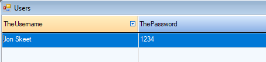

<iframe width="560" height="315" src="https://www.youtube.com/embed/Z1uljBHEXs8?list=PL1DEQjXG2xnJF4Jon_mjd-QnmsQ3KBWLr" frameborder="0" allowfullscreen></iframe>

Storage is a column attribute, which defines the way the value of the columns is saved to the database and loaded from it.
Storage is used to separate the way a value is stored in persistant storage from the way it is used by the application.
There are many built in storages that we can use. For example,the DateTimeDateStorage is used to store dates as DateTime in the Database, while the StringDateStorage allows us to keep dates as strings.
The migrated application comes with a plethora of storages for numbers, texts, dates, times and bool. 

With the rise of internet services and mobile apps, many regulations have been made to keep our personal data protected.
For example, to comply with GPDR, companies are required to encrypt any personal identifiable information (PII), such as id numbers, emails, credit card numbers etc. 
We are often asked how to implement this in migrated applicaitons. Storage is a great way to do it.

### We need an Encryptor
Assuming that we have some kind of encryption mecahnism, here is a simple examle of an encryptor class:
```csdiff
using System;
using System.Text;

namespace Northwind.Demo
{
    public static class Encryptor
    {
        static ENV.UserMethods u = new ENV.UserMethods();
        static byte[] key = Encoding.Unicode.GetBytes("MyKey");

        public static string EncryptToBase64(string value)
        {
            return Convert.ToBase64String(u.Cipher(1, Encoding.Unicode.GetBytes(value.TrimEnd()), key));
        }

        public static string DecryptFromBase64(string value)
        {
            return Encoding.Unicode.GetString(u.DeCipher(1, Convert.FromBase64String(value), key));
        }
    }
}
```

### Creating our Storage

All storages implement a simple interface named IColumnStorageStrategy<T> with two methods, LoadFrom and SaveTo.
Let's create our own storage class and implement this interface using our Encryptor:
```csdiff
using Firefly.Box;
using Firefly.Box.Data.DataProvider;

namespace Northwind.Demo
{
    class EncryptedTextStorage : IColumnStorageSrategy<Text>
    {
        public Text LoadFrom(IValueLoader loader)
        {
            var dbVal = loader.GetString();
            return Encryptor.DecryptFromBase64(dbVal);
        }

        public void SaveTo(Text value, IValueSaver saver)
        {
            if (value == null)
                saver.SaveNull();
            else
                saver.SaveString(Encryptor.EncryptToBase64(value), 100, false);
        }
    }
}

```

Finally, let's use the new storage we created in our Entity to encrypt the password column:
```csdiff
using ENV.Data;

namespace Northwind.Demo
{
    public class Users : Entity
    {
        [PrimaryKey]
        public readonly TextColumn Username = new TextColumn("TheUsername", "30");
        public readonly TextColumn Password = new TextColumn("ThePassword", "30") { Storage = new Demo.EncryptedTextStorage()};

        public Users() : base("Users", Shared.DataSources.Northwind1)
        {
        }
    }
}
```

### The test drive

Here we add a new user to our table using the entity browser in the application:



And here is how the password is saved to the databse:

