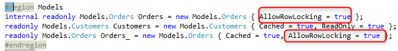

keywords:lockcurrentrow ,rowlocking, lockingstrategies, lockingstrategy, onUserEdit, OnMoodify,LockCurrentRowIfItWasChanged

Every Controller has a property called `RowLocking` which controls when locking shall be applied for this controller.

The different locking strategies are detailed in the documentation of [LockingStragey](http://www.fireflymigration.com/reference/html/T_Firefly_Box_LockingStrategy.htm).
To see the comparison of the different strategies to magic see [Locking Strategy in magic](locking-strategy.html)

### When Will the locking start?
The start of the locking is controlled by the `RowLocking` property - and is based on the strategy.
* None - the lock will never start
* OnRowLoading - the lock wills start once the row is loaded - just before the `EnterRow` event.
* OnRowSaving - the lock with start before the row is saved to the database - after the `SavingRow` event.
* OnUserEdit - the lock will start when the user edits a value on the screen

#### LockCurrentRow method
When using the `OnUserEdit` LockingStrategy - the lock can be started by calling the `LockCurrentRow()` method.
In the migrated code, you'll see a call to the `LockCurrentRow()` method whenever magic would have started a lock.

When the `LockCurrentRow()` method is called for the first time since entering the row, it'll lock the row. Any subsequent calls to the `LockCurrentRow()` method will be ignored - since the row is already locked.

You may see many calls in the migrated code to `LockCurrentRow()`  in controllers that were migrated and were using the `OnModify` magic locking strategy, that is because magic was starting locks on updates and call programs based on in many different (And sometimes mysterious) scenarios.
We made sure the make the call to `LockCurrentRow` apparent and to highlight this behavior.

If you see many subsequent calls to `LockCurrentRow()`, don't worry about it - as only the first one locks.

#### LockCurrentRowIfItWasChanged method
It's a variation of the `LockCurrentRow` method that will only lock if the row was already changed, based on the `RowChanged` property.
It is used in the migrated code whenever magic was locking but not always - just when the row was changed.

### Which entities will be locked?
When the lock starts, all entities for which the `AllowRowLocking` property is set, will be locked.

> Note that if the same entity was already defined in a calling controller with `AllowRowLocking = true`, than that same entity in this controller will also be treated as if `AllowRowLocking` is set to true.
that is controlled by the `ShouldDetermineNameAcordingToCallStack` property of the entity. Set this property to false to disable that behavior.

### When will the lock be released?
Any row that was updated will remain locked until the end of the transaction.

Rows that were not updated, will have their lock released according the the specific database that is in use.
* For Oracle, SQL Server ODBC, and oledb the lock will only be released after the transaction is committed. 
> we are currently working on a solution where in SQL server the lock could be released after it was left - let us know if you're interested.
* For Btrieve, Pervasive, DB2 Iseries, DB2, Easycom - the lock will be released after you leave the row (after the `SavingRow` event)

### Locking and Transactions
* Btrieve (Pervasive) and eascom ISAM - allows for locking without a transaction.
* In SQL Server, Oracle, DB2, ODBC etc... you can only lock if a transaction was already opened.
> we are current working on a solution where in SQL server and DB2 you'll be able to lock without a transaction.
