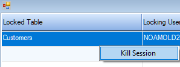
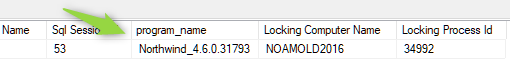
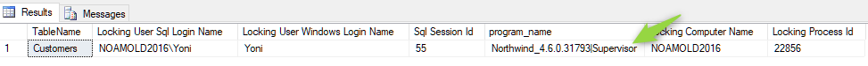
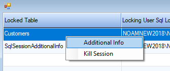

Many times we want to add to our application the method the information of who is locking, and what is being locked.

In this article we'll describe several ways to do that.


## Seeing which tables are locked and who is locking them
You can use the following query, to see the current tables that are locked and who is locking them:
```sql
SELECT 
	OBJECT_NAME(rsc_objid,rsc_dbid) 'TableName', 
	b.login_name 'Locking User Sql Login Name',
    b.nt_user_name 'Locking User Windows Login Name',
	b.session_id 'Sql Session Id',
	b.program_name,
	b.host_name 'Locking Computer Name',
	b.host_process_id 'Locking Process Id'
FROM master.dbo.syslockinfo a left outer join sys.dm_exec_sessions b on a.req_spid=b.session_id 
WHERE  req_spid>=0 AND rsc_objid>0 AND rsc_type=5
```
>See the end of this article for other, (and even more useful) queries that were found after this article was originally written
Here's a sample result:


> For customers that have migrated from btrieve to Sql up to 2018, see the following article for a query that will display locking:
> http://doc.fireflymigration.com/locking-after-btrieve-to-sql-migration.html


Here's an example of a `UIController` that runs this sql:
```csdiff
class ShowLocks : UIControllerBase
{
    public readonly TextColumn TableName = new TextColumn("Locked Table");
    public readonly TextColumn LockingSqlUser = new TextColumn("Locking User Sql Login Name");
    public readonly TextColumn LockingWindwsUser = new TextColumn("Locking User Windows Login Name");
    public readonly NumberColumn Session = new NumberColumn("Sql Session Id","5");
    public readonly TextColumn ProgramName = new TextColumn("Program Name");
    public readonly TextColumn ComputerName = new TextColumn("Locking Computer Name");
    public readonly NumberColumn ProcessId = new NumberColumn("Locking Computer Process Id", "6");
    public ShowLocks()
    {
        
    }
    protected override void OnLoad()
    {
        Activity = Activities.Browse;
        View = () => new ENV.UI.GridView(this.Columns.ToArray());
    }
    
    public void Run()
    {
        var sql = @"SELECT 
OBJECT_NAME(rsc_objid,rsc_dbid) 'TableName', 
b.login_name 'Locking User Sql Login Name',
b.nt_user_name 'Locking User Windows Login Name',
b.session_id 'Sql Session Id',
b.program_name,
b.host_name 'Locking Computer Name',
b.host_process_id 'Locking Process Id'
FROM master.dbo.syslockinfo a left outer join sys.dm_exec_sessions b on a.req_spid=b.session_id 
WHERE  req_spid>=0 AND rsc_objid>0 AND rsc_type=5";

        var sqlEntity = new DynamicSQLEntity(Shared.DataSources.Northwind,sql);

        sqlEntity.Columns.Add(TableName, LockingSqlUser, LockingWindwsUser, Session, ProgramName, ComputerName, ProcessId);
        From = sqlEntity;
        
        Execute();
    }
}
```


## Showing to the locked user, who is locking the table they are trying to use
If you want to display to the user what other users are locking the table they are trying to access - let's modify the `ShowLocks` controller to filter on a table:
```csdiff
class ShowLocks : UIControllerBase
{
    public readonly TextColumn TableName = new TextColumn("Locked Table");
    public readonly TextColumn LockingSqlUser = new TextColumn("Locking User Sql Login Name");
    public readonly TextColumn LockingWindwsUser = new TextColumn("Locking User Windows Login Name");
    public readonly NumberColumn Session = new NumberColumn("Sql Session Id","5");
    public readonly TextColumn ProgramName = new TextColumn("Program Name");
    public readonly TextColumn ComputerName = new TextColumn("Locking Computer Name");
    public readonly NumberColumn ProcessId = new NumberColumn("Locking Computer Process Id", "6");
    public ShowLocks()
    {
        
    }
    protected override void OnLoad()
    {
        Activity = Activities.Browse;
        View = () => new ENV.UI.GridView(this.Columns.ToArray());
    }
-   public void Run()   
+   public void Run(Text lockedTable=null)
    {
        var sql = @"SELECT 
OBJECT_NAME(rsc_objid,rsc_dbid) 'TableName', 
b.login_name 'Locking User Sql Login Name',
b.nt_user_name 'Locking User Windows Login Name',
b.session_id 'Sql Session Id',
b.program_name,
b.host_name 'Locking Computer Name',
b.host_process_id 'Locking Process Id'
FROM master.dbo.syslockinfo a left outer join sys.dm_exec_sessions b on a.req_spid=b.session_id 
WHERE  req_spid>=0 AND rsc_objid>0 AND rsc_type=5";

+       if (!Text.IsNullOrEmpty(lockedTable))
+       {
+           sql += " and rsc_objid=object_id('" + lockedTable.Trim().Replace("'", "''") + "')";
+           sql += " and b.session_id!=@@spid"; //exclude my locks
+       }

        var sqlEntity = new DynamicSQLEntity(Shared.DataSources.Northwind,sql);

        sqlEntity.Columns.Add(TableName, LockingSqlUser, LockingWindwsUser, Session, ProgramName, ComputerName, ProcessId);
        From = sqlEntity;
        
        Execute();
    }
}
```


And add an handler in the  `ApplicationCore` class.
```csdiff
Handlers.AddDatabaseErrorHandler(DatabaseErrorType.LockedRow).Invokes += e =>
{
    new ShowLocks().Run(e.Entity.EntityName);
};
```

You can also change the default behavior when locking from retry to abort by changing the `HandlingStrategy`
```csdiff
Handlers.AddDatabaseErrorHandler(DatabaseErrorType.LockedRow).Invokes += e =>
{
    new ShowLocks().Run(e.Entity.EntityName);
+   e.HandlingStrategy = DatabaseErrorHandlingStrategy.RollbackAndRecover;
};
```

## Kill the locking session

If you want to kill the locking session, you can use the  [KILL (Transact-SQL)](https://docs.microsoft.com/en-us/sql/t-sql/language-elements/kill-transact-sql).

Here's how we add that to our controller:
```csdiff
protected override void OnLoad()
{
    Activity = Activities.Browse;
-   View = () => new ENV.UI.GridView(this.Columns.ToArray());
+   View = () =>
+   {
+       var v = new ENV.UI.GridView(this.Columns.ToArray());
+       v.AddAction("Kill Session", () =>
+       {
+           try
+           {
+               Shared.DataSources.Northwind.Execute("kill " + Session.ToString().Trim() + "");
+               Common.ShowMessageBox("Kill session " + Session.ToString().Trim(), MessageBoxIcon.Information, "Session Killed");
+           }
+
+           catch (Exception ex)
+           {
+               Common.ShowMessageBox("Kill session " + Session.ToString().Trim(), MessageBoxIcon.Error, "Failed to kill session: "+ex.Message);
+           }
+       });
+       return v;
+   };
}
```

Now the user can kill the session by right clicking on it and choosing kill session:



## "We are using the same Sql account for all our users, how can we know who is the locking user?"
Often a single sql server user account is used, but we still want to know what is the user that logged in to the application.
In .NET we have control of the sql `Program_name`:



We can change it to include the user that was used to login to the application.
On the `ConnectionManager` class in ENV, you'll find, search for the word `applicationName` and make the following change:
```csdiff
if (n != null)
{
    var
        applicationName
            =
            n.Name +
            "_" +
            n.Version
                .
                ToString
                ();
+   applicationName += "|" + Security.UserManager.CurrentUser.Name;
    connect.Append(
        "Application Name=" +
        applicationName +
        ";");
}
```
And you'll see it in the `program_name` column:



## "How can we know on which screen the user is now?"
The way to do that is to create a table that will know where the user is, and update it every x seconds.

The following code sample records every 5 seconds the:
1. Screen - the Form that the user is on
2. Controller - the Controller the user was on.
3. ControllerThatOpenedTheTransaction - the controller where the transaction was opened.
4. LastUpdate - the last time the values have changed (if the user is on the screen for an hour, there is no point in updating the db again and again, you'll see it using this value.)


Add the following entity to the application.

```csdiff
public class SqlSessionAdditionalInfo : Entity
{
    [PrimaryKey]
    public readonly NumberColumn Session = new NumberColumn("SqlSessionId", "5");
    public readonly Firefly.Box.Data.DateTimeColumn LastUpdate = new Firefly.Box.Data.DateTimeColumn("LastUpdate");
    public readonly TextColumn Screen = new TextColumn("Screen", "2000");
    public readonly TextColumn Controller = new TextColumn("Controller", "2000");
    public readonly TextColumn ControllerThatOpenedTheTransaction = new TextColumn("ControllerThatOpenedTheTransaction", "2000");
    public SqlSessionAdditionalInfo() : base("SqlSessionAdditionalInfo", Shared.DataSources.Northwind)
    {

    }
}
```


In the `ApplicationCore` class add the following handler
```csdiff
var lastKkey = "";
var tableExists = false;
Number currentSsessionId = null;
Handlers.Add(Command.CreateTimer(5)).Invokes += e =>
{

    var screenName = "Application";
    ITask controller = null;
    ITask controllerThatOpenedTheTransaction = null;

    foreach (var c in Context.Current.ActiveTasks)
    {
        if (c.View != null && !c.View.ChildWindow)
            screenName = c.View.Text;
        controller = c;
        if (controllerThatOpenedTheTransaction == null && c.InTransaction)
            controllerThatOpenedTheTransaction = c;
    }
    var controllerName = "";
    var transactionControllerName = "";
    if (controller!=null)
        //note that you'll need to change the SendInstanceBasedOnTaskAndCallStack method to public :)
        ControllerBase.SendInstanceBasedOnTaskAndCallStack(controller, c => controllerName = c.GetType().FullName);
    if (controllerThatOpenedTheTransaction!=null)
        ControllerBase.SendInstanceBasedOnTaskAndCallStack(controllerThatOpenedTheTransaction, c => transactionControllerName = c.GetType().FullName);

    var key = controllerName + screenName + controllerThatOpenedTheTransaction;
    if (key == lastKkey)
        return; //we only want to update the session info if it has changed. If the user is on the screen for a while, there is no point in sending an update every 5 seconds.
    lastKkey = key;
    var sInfo = new SqlSessionAdditionalInfo();
    if (!tableExists)
    {
        tableExists = sInfo.Exists();
        if (!tableExists)
            Shared.DataSources.Northwind.CreateTable(sInfo);
        tableExists = true;
    }
    if (currentSsessionId == null)
    {
        // get the spid if we don't already know it
        using (var c = Shared.DataSources.Northwind.CreateCommand())
        {
            c.CommandText = "select @@spid";
            currentSsessionId = Number.Cast(c.ExecuteScalar());
        }
    }

    sInfo.InsertIfNotFound(sInfo.Session.BindEqualTo(currentSsessionId), () =>
    {
        sInfo.LastUpdate.Value = System.DateTime.Now;
        sInfo.Screen.Value = screenName;
        sInfo.Controller.Value = controllerName;
        sInfo.ControllerThatOpenedTheTransaction.Value = transactionControllerName;
    });
};
```

You can query this from the database using the following sql:
```sql
select * from SqlSessionAdditionalInfo with(nolock)
```

Or you can add this info to the `ShowLocks`
```csdiff
...
protected override void OnLoad()
{
    Activity = Activities.Browse;
    View = () =>
    {
        var v = new ENV.UI.GridView(this.Columns.ToArray());
+       v.AddAction("Additional Info", () =>
+       {
+           var sInfo = new SqlSessionAdditionalInfo();
+           sInfo.ForEachRow(sInfo.Session.IsEqualTo(Session), () =>
+           {
+               Common.ShowMessageBox("Session Info " + Session.ToString().Trim(), MessageBoxIcon.Information,
+                   "Screen: " + sInfo.Screen.Value.Trim() +
+                   "\r\nController: " + sInfo.Controller.Value.Trim() +
+                   "\r\nTransaction Opened On: " + sInfo.ControllerThatOpenedTheTransaction.Trim() +
+                   "\r\nEstimated duration on Screen: " + (DateTime.Now - sInfo.LastUpdate).Minutes.ToString() + " minutes");
+           });
+       });
        v.AddAction("Kill Session", () =>
        {
            try
            {
                Shared.DataSources.Northwind.Execute("kill " + Session.ToString().Trim() + "");
                Common.ShowMessageBox("Kill session " + Session.ToString().Trim(), MessageBoxIcon.Information, "Session Killed");
            }

            catch (Exception ex)
            {
                Common.ShowMessageBox("Kill session " + Session.ToString().Trim(), MessageBoxIcon.Error, "Failed to kill session: " + ex.Message);
            }
        });
        return v;
    };
}

...
```

And it'll look like this:




### UPDATE: Another SQL Monitoring Query
Recently I've ran into another great query to show the lock info, including the last sql for that connection:
```sql
SELECT  l.request_session_id AS SPID,
        DB_NAME(l.resource_database_id) AS DatabaseName,
        o.name AS LockedObjectName,
		l.resource_associated_entity_id,
		l.resource_description,
        p.object_id AS LockedObjectId,
        l.resource_type AS LockedResource,
        l.request_mode AS LockType,
        ST.text AS SqlStatementText,    
		ES.login_name 'Locking User Sql Login Name',
		ES.nt_user_name 'Locking User Windows Login Name',
		ES.session_id 'Sql Session Id',
		ES.program_name,
		ES.host_name 'Locking Computer Name',   
        TST.is_user_transaction as IsUserTransaction,
        CN.auth_scheme as AuthenticationMethod
FROM    sys.dm_tran_locks l
        JOIN sys.partitions p ON p.hobt_id = l.resource_associated_entity_id
        left outer JOIN sys.objects o ON o.object_id = p.object_id
        JOIN sys.dm_exec_sessions ES ON ES.session_id = l.request_session_id
         JOIN sys.dm_tran_session_transactions TST ON ES.session_id = TST.session_id
        JOIN sys.dm_tran_active_transactions AT ON TST.transaction_id = AT.transaction_id
        JOIN sys.dm_exec_connections CN ON CN.session_id = ES.session_id
        CROSS APPLY sys.dm_exec_sql_text(CN.most_recent_sql_handle) AS ST
WHERE   resource_database_id = db_id()
ORDER BY l.request_session_id
```
 ### UPDATE 2: Finding the locked row
 When you run the previous select, the column `resource_description` holds the key to find the actual locked row. 
 Any table has a "virtual" column that represents that value called `%%lockres%%` which can be used to find the specific row
 
 For example - if the `LockedObjectName` is `Customers` and the `resource_description` is "(46003d087fa5)"
 
 The following query will return the locked customer row:
 ```SQL
 select *,%%lockres%% from customers with (nolock) WHERE %%lockres%% = '(46003d087fa5)'
 ```
