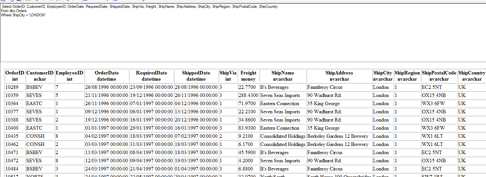
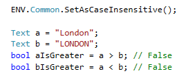

## The Scenario
We filter data by text and suddenly no rows are displayed. Surprisingly, when we run the same SQL directly on the database, it returns a lot or rows that match the filter criteria.
Further more, if we use the correct casing for the filter (i.e London), the application will happily display these rows.
For example, in Northwind application, we have a lot of orders where the ship city is London. Let's try to filter by the uppercase text "LONDON":


As you can see below, no rows are returned.


However, let's take the original SQL statement and run it using the SQL Executer developer tool. As you can see, we get a lot of rows that match the filter.


## So, why is the application case sensitive when the database is not?
This is actually the behavior of the original application that was migrated to .NET. The migration to .NET must keep the same behavior of comparing texts.
If the original application was case sensitive, the .NET application will be just as sensitive.
Basically, the application validates the data that is returned from the server and exclude the rows that do not match the filter without ignoring casing. 
Fortunately, it is very easy to change this behavior. 

## Solution #1 - Changing behavior for a specific controller
One way we can bypass the application revalidation of the filter is to change the Where clause of the controller to SQL Where:


## Solution #2 - Changing behavior for a specific Database field
Another way to bypass the application revalidation of the filter is to change the property of a database field by setting the option DbCaseInsensitive to true:

*Set this property at the model:*
```csdiff
public readonly TextColumn ShipCity = new TextColumn("ShipCity", "20") { AllowNull = false, **DbCaseInsensitive = true** };
```

## Solution #3 - Globally changeing the applicaiton behavior
Another way to change this behavior of text compare globally is by calling the ENV.Common.SetAsCaseInsensitive() method in Program.Main()


Notice that this changes the way the application compare texts, for example:
Before the change, the application is case sensitive so:


After the change, the application is case insensitive so:

