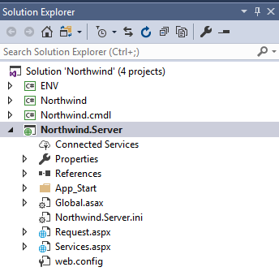
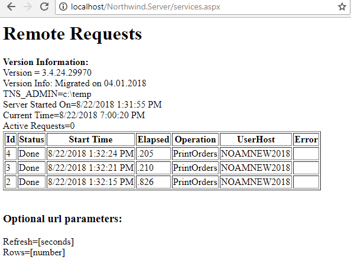
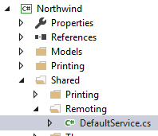
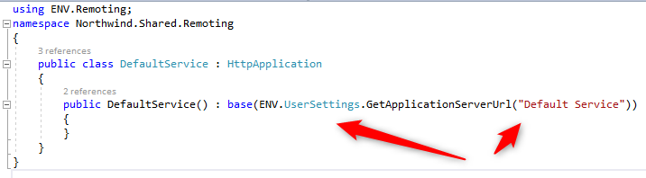
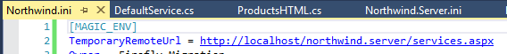
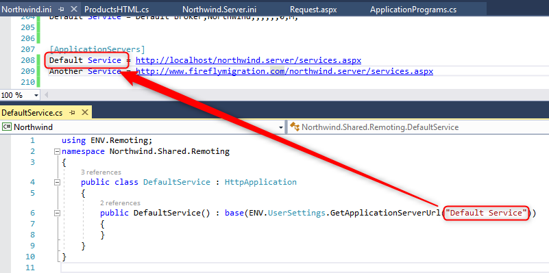

keywords:Broker
In magic you had the option to use an Enterprise server that allowed you to run code on the server.

To do that you had to configure a server, run a broker on it and load a  magic engine to handle requests that the server recieved.
Let's call it the `Application Server`

To call that server, you would have used `CallRemote` or `mgrqcmdl.exe`

In .NET the application server is `IIS` - it replaces the Broker and the engines that you would have run on the server.

In the migration, such application will also have a project called `.Server` for example `Northwind.server`.



In that project you would find a file called `Services.aspx` that manages all of this.

That project is then mapped to a virtual directory on the IIS. See the [IIS configuration article](iis-configuration.html)

Once you navigate to the Services.aspx url on the web browser you'll get a small monitor application that allows you to follow up on the server information.




## Calling the Server from an Application

For every Service that was defined in the migrated application you'll find a class in `...Shared.Remoting'



Here's it's code:


As you can see - this class goes to the `UserSettings` class to get the Server's url based on the Service name from the ini file.

If you'll look into the code of `GetApplicationServerUrl` you'll see that there are two ways to configure the server url.
1. For simple cases where there is only one server, you can add an entry in the ini called `TemporaryRemoteUrl` with the url of the services.aspx file.


2. For more complex cases, where you have multiple services, you can add a section in the ini called `ApplicationServers` and add entries based on the Service Name set in the .cs file under the `Remoting` namespace.


### Performing the Actual Call from the code
Calling the service is simply done by Creating a new instance of the `Service` class and calling it's run method:
```csdiff
new Shared.Remoting.DefaultService().Run("PrintService", "SomeArgument", "AnotherArgument");
```
The first argument is the `PublicName` of the controller as defined in the `ApplicationPrograms` class. The other arguments are simply sent to that controller.
For more call variations see [Call Remote article](call-remote.html)


### Calling a Remote Controller using a command line
You can also call a remote controller using a command line, the CMDL.exe file. See [Running cmdl.exe article](running-cmdl.exe.html)

### Calling a remote Controller using HTTP
You can also call a remote controller using simple HTTP - which is very useful in some scenarios.
The syntax is similar to calling a web request.
```
http://localhost/Northwind.Server/services.aspx?prgname=PrintOrders&Arguments=someargument,anotherargument
```


<iframe width="560" height="315" src="https://www.youtube.com/embed/eIXfLzw99IU" frameborder="0" allowfullscreen></iframe>
