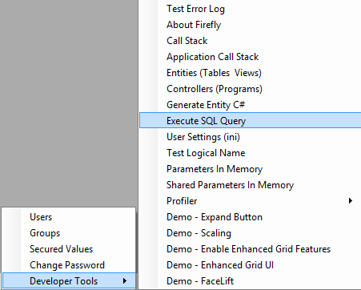
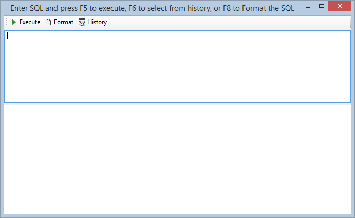
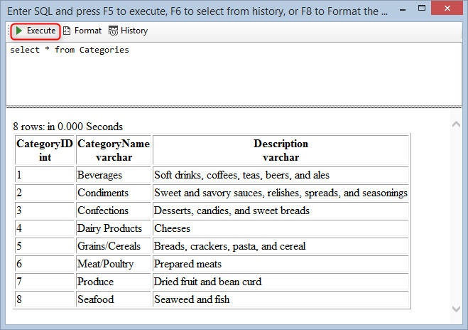
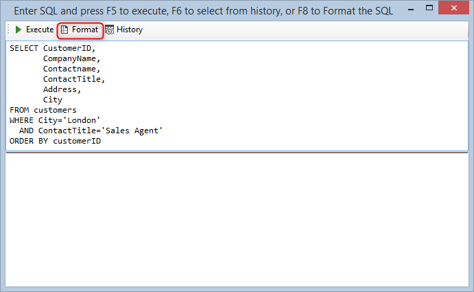
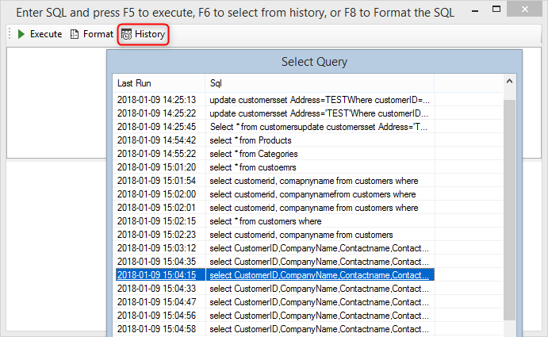
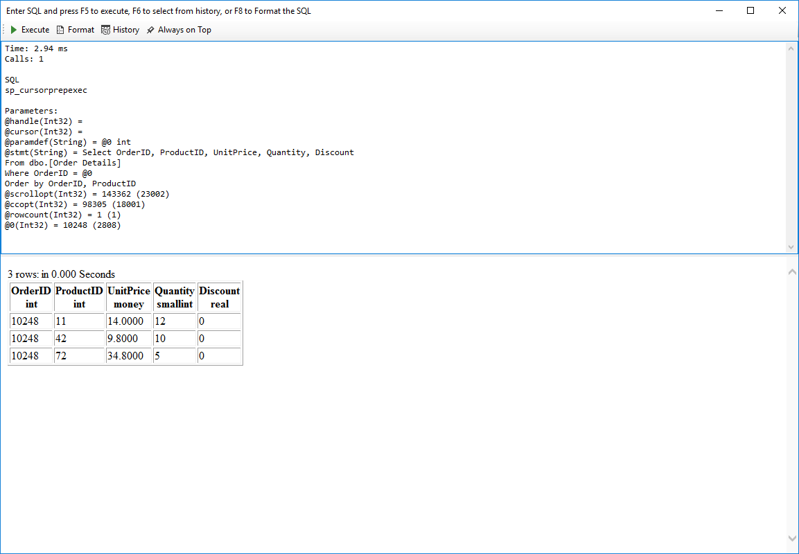

# SQL Editor Tool

In every migration project we provide a set of Developer Tools. One of these useful tools is the SQL Editor.






The advantages of having this tool built-in the application are:
1) No need to have SQL Management Studio installed on the workstation
2) The SQL editor uses the same connection of the application so for example, you can query memory tables

The SQL editor supports any relational database management system (RDBMS) and contains three options:


### Execute (F5)

Divided into two parts:
1) Upper pane - SQL Commands area
2) Lower pane- Results set

You can use any DML commands in the SQL editor (query, update, delete and insert and etc)




### Format (F8)

We often copy an SQL statement, written in one line, directly into the SQL editor. It will be much easier to read the statement if it is well formatted.
Clicking on the Format button (F8) while the SQL statement is in the upper pane will format the SQL code.


###### Not Formatted
```sql
select CustomerID,CompanyName,Contactname,ContactTitle,Address,City from customers where City='London' and ContactTitle='Sales Agent' order by customerID
```

###### Formatted
```sql
SELECT CustomerID,
       CompanyName,
       Contactname,
       ContactTitle,
       Address,
       City
FROM customers
WHERE City='London'
  AND ContactTitle='Sales Agent'
ORDER BY customerID
```

<br>



## History (F6)

The History button (F6) will display all the previous SQL statements that were used.
Clicking on the desired statement will copy it to the SQL commands area so you can re-run it





## Profiler SQL statement

You can copy an SQL statement from the Firefly profiler "AS IS" with the parameters and the SQL editor will execute it



---
**See Also:**
* [Developer Tools](http://doc.fireflymigration.com/access-developer-tools-and-users-management-menu.html)
* [Firefly Profiler](http://doc.fireflymigration.com/fireflyprofiler.html)

---
