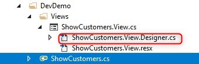

keywords: designer, form, view, dynamic, screen

# Understanding the code

If you open the View.Designer code, you will see there is a basic patern for all the controls on the view.  
You can see the designer code by:
1. Open the view code and pressing F12 (Go To Definition) on the ```InitializeComponent();``` method.
2. Expand the View the press F7 while hovering over the Designer.cs  


There is an hirarchy of controls:
* In case there is a grid, a control will be "bound" to a grid column - a grid column is a collection of controls
* A grid column(s) is "bound" to a grid – a grid is a collection of grid columns
* Any control not "bound" to the grid (and the grid itself) are "bound" to the view - a view is a collection of controls

Every control has:
1. Name
2. Type
3. Data (optional)
4. Attribute (optional)

So for example, let's take one control 

```
// The grid control
this.grid1 = new Northwind.Shared.Theme.Controls.Grid(); 
// The grid column
this.gcCustomerID = new Northwind.Shared.Theme.Controls.GridColumn();
// Add the grid column to the grid
this.grid1.Controls.Add(this.gcCustomerID);
// The textbox 
this.txtCustomerID = new Northwind.Shared.Theme.Controls.TextBox();
// Add the textbox to the grid column
this.gcCustomerID.Controls.Add(this.txtCustomerID);
// The column title
this.gcCustomerID.Text = "CustomerID";
// The textbox data 
this.txtCustomerID.Data = this._controller.Customers.CustomerID;
```

This is the screen I have now:  


The next article will use this method to add a new column.