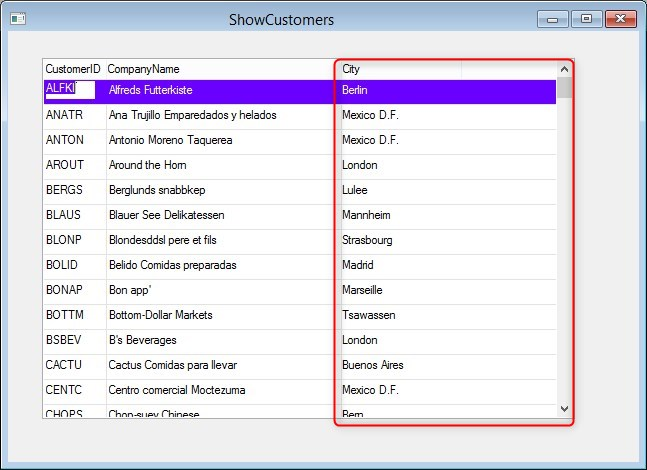

keywords: designer, form, view, dynamic, screen

# Adding the first column

So if we want to add a new column, we can simply add the required code for it, this time from the View code:

```csdiff

partial class ShowView : Shared.Theme.Controls.Form
{
    ShowCustomers _controller;
    public ShowView(ShowCustomers controller)
    {
        _controller = controller;
        InitializeComponent();
+        AddColumn();
    }

+    void AddColumn()
+    {
+       // The grid column
+        var gcCity = new Shared.Theme.Controls.GridColumn() { Text = "City" };
+       // The textbox 
+        var tbCity = new Shared.Theme.Controls.TextBox() { Style = Firefly.Box.UI.ControlStyle.Flat };
+       // The textbox data 
+        tbCity.Data = _controller.Customers.City;
+       // Add the textbox to the grid column
+        gcCity.Controls.Add(tbCity);
+       // Add the grid column to the grid
+        grid1.Controls.Add(gcCity);
+    }
}
```

> Note the attributes uses for the column title and the textbox style

This is the result:  


The next article will use the ```AddColumn``` method in a more dynamic approach.