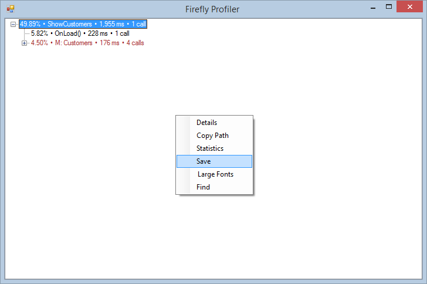

keywords:profiler, guide,

There are several ways to activate the profiler:
* From the Developer Tools menu
* Using a keyboard Short key
* As an INI entry

1) Starting the Profiler  
While the application is open, Right-Click on the status bar:  
**Developer Tools -> Profiler** -> Click **Start Profiling**, or use the keyboard shortkey:    <kbd>Ctrl</kbd>+<kbd>Shift</kbd>+<kbd>P</kbd>

  Run the process 

2) End the Profiler   
Once the process is done, click **End Profiling** in the toolbar menu or use the keyboard shortkey again: <kbd>Ctrl</kbd>+<kbd>Shift</kbd>+<kbd>P</kbd> 

3) Saving the Profiler  
Right-Click on the results screen will bring a context menu with 6 options.  
Click **Save** ,specify the path and file name and send us the file.

5) Profiler settings in the INI   
To start the Profiler for the Web or without using Developer tools,
Simply add an entry to the INI file in the [MAGIC_ENV] section:

        Profiler= c:\temp\myfile.prof

Or as an argumant from the command line:

        /Profiler= *c:\temp\myfile.prof

Notice that a Profiler for the Web will create a file for each request.

* The Profiler is part of the migrated solution but you can also download it from here:  
http://doc.fireflymigration.com/fireflyprofiler.html
* For more information on the Profiler, please visit:  
http://doc.fireflymigration.com/using-firefly-profiler.html
