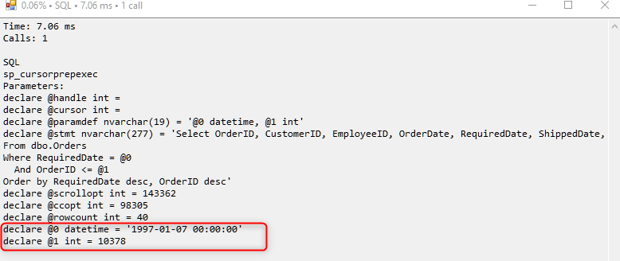

Any SQL that is written to the profiler, dblog or query exceptions, now includes the bound parameters as a set of `declare` statements that SQL Management studio can use to run that sql with it's bound parameters.

See
<iframe width="560" height="315" src="https://www.youtube.com/embed/9xkmeGIZZx4" frameborder="0" allowfullscreen></iframe>

## Integrating to older versions of ENV
The change was done between versions: 31718 and 31719 - you can run a migration of both these versions and compare env.
The files that were touched are:
1. LogDatabaseWrapper.cs
2. SQLClient.cs
3. Profiler.cs