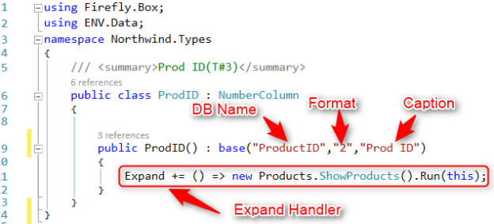
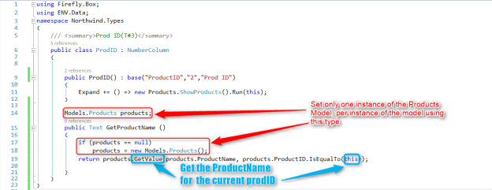
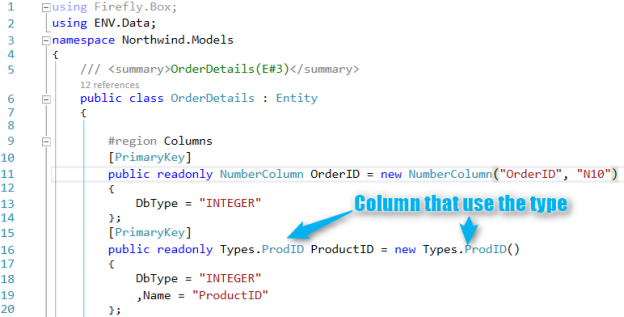
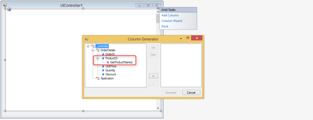
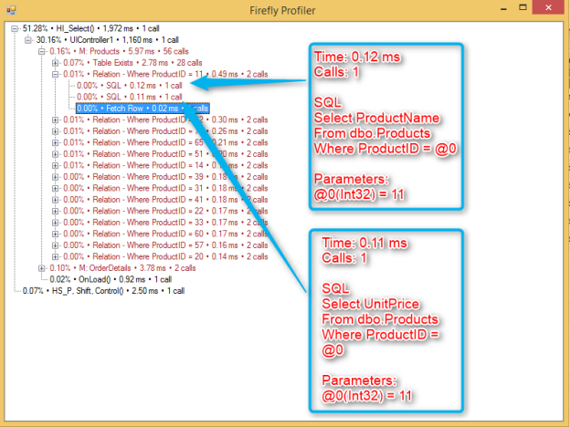
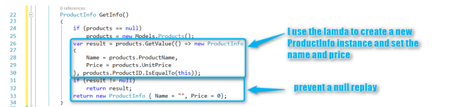
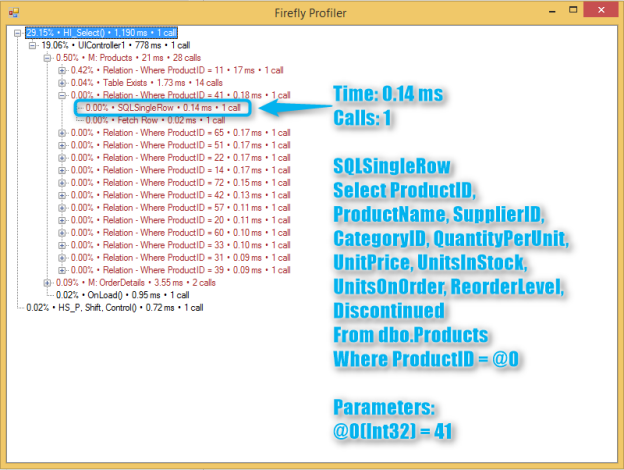

# Types, I want more out of it !


The original usage of types in the migrated application was no more than just having one place in the code, to set up the format and may be a DB name and caption of a column.

Some of the developers use it to set up an Expand handler for all the columns using this type.

So the code looks like :
```csdiff
using Firefly.Box;
using ENV.Data;
namespace Northwind.Types
{
    /// <summary>Prod ID(T#3)</summary>
    public class ProdID : NumberColumn
    {
        public ProdID() : base("ProductID","2","Prod ID")
        {
            Expand += () => new Products.ShowProducts().Run(this);
        }
    }
}
```



So the question is how to get more out of it ?

## Using the type to get the description
Since the type is a class we can add more code to it. The first thing we can do is add a method that will return relevant information like the product name.  

We'll apply the refactoring specified in [Refactoring the Relation to the Type Class](refactoring-the-relation-to-the-type-class.html)
Using this method here will save the developer the need to use a Relation in the programs.
So now the code will look like that :

```csdiff
using Firefly.Box;
using ENV.Data;
namespace Northwind.Types
{
    /// <summary>Prod ID(T#3)</summary>
    public class ProdID : NumberColumn
    {
        public ProdID() : base("ProductID","2","Prod ID")
        {
            Expand += () => new Products.ShowProducts().Run(this);
        }
 
        Models.Products products;
        public Text GetProductName ()
        {
            if (products == null)
                products = new Models.Products();
            return products.GetValue(products.ProductName, products.ProductID.IsEqualTo(this)); 
        }
    }
}
```



Now, whenever this type is used, there is no need to add a Relation to the Products model, you can get the product name directly from the column that use the type, for example:  
  


As you can see the column wizard recognizes not only the column itself, but also its public methods, such as the GetProductName, and allows you to use it.


## Getting more than one column with GetValue
But now what will I do if I need more than just the product name ?  
What if I need two or more columns from the Products model ?  
The first option looks like more of the same, meaning:  
```csdiff
using Firefly.Box;
using ENV.Data;
namespace Northwind.Types
{
    /// <summary>Prod ID(T#3)</summary>
    public class ProdID : NumberColumn
    {
 
        public ProdID() : base("ProductID","2","Prod ID")
        {
            Expand += () => new Products.ShowProducts().Run(this);
        }
 
        Models.Products products;
        public Text GetProductName ()
        {
            if (products == null)
                products = new Models.Products();
            return products.GetValue(products.ProductName, products.ProductID.IsEqualTo(this));
 
        }
        public Number GetProductPrice()
        {
            if (products == null)
                products = new Models.Products();
            return products.GetValue(products.UnitPrice, products.ProductID.IsEqualTo(this));
 
        }
    }
}
```

## Reducing the number of calls to the database
The problem is that now we will have two queries going to the database:

So we need to improve our code,  we need one SQL query that will return more than one column a time. To do so we need some ground work. We need to create a new object that will store all the information we need :
```csdiff
using Firefly.Box;
using ENV.Data;
namespace Northwind.Types
{
    /// <summary>Prod ID(T#3)</summary>
    public class ProdID : NumberColumn
    {
 
        public ProdID() : base("ProductID","2","Prod ID")
        {
            Expand += () => new Products.ShowProducts().Run(this);
        }
 
+       class ProductInfo
+       {
+           public Text Name;
+           public Number Price;
+       }
 
        Models.Products products;
    }
}
```
Now we need to get the data from the model :

```csdiff
using Firefly.Box;
using ENV.Data;
namespace Northwind.Types
{
    /// <summary>Prod ID(T#3)</summary>
    public class ProdID : NumberColumn
    {
 
        public ProdID() : base("ProductID","2","Prod ID")
        {
            Expand += () => new Products.ShowProducts().Run(this);
        }
 
        class ProductInfo
        {
            public Text Name;
            public Number Price;
        }
 
        Models.Products products;
 
        ProductInfo GetInfo()
        {
            if (products == null)
                products = new Models.Products();
            var result = products.GetValue(() => new ProductInfo
            {
                Name = products.ProductName,
                Price = products.UnitPrice
            }, products.ProductID.IsEqualTo(this));
            if (result != null)
                return result;
            return new ProductInfo { Name = "", Price = 0};
        }
    }
}
```

Let us get the two methods returning the name and the price back, but this time we will use the ProductInfo object
```csdiff
using Firefly.Box;
using ENV.Data;
namespace Northwind.Types
{
    /// <summary>Prod ID(T#3)</summary>
    public class ProdID : NumberColumn
    {
 
        public ProdID() : base("ProductID","2","Prod ID")
        {
            Expand += () => new Products.ShowProducts().Run(this);
        }
 
        class ProductInfo
        {
            public Text Name;
            public Number Price;
        }
 
        Models.Products products;
 
        ProductInfo GetInfo()
        {
            if (products == null)
                products = new Models.Products();
            var result = products.GetValue(() => new ProductInfo
            {
                Name = products.ProductName,
                Price = products.UnitPrice
            }, products.ProductID.IsEqualTo(this));
            if (result != null)
                return result;
            return new ProductInfo { Name = "", Price = 0};
        }
        public Text GetProductName()
        {
            return GetInfo().Name;
 
        }
        public Number GetProductPrice()
        {
            return GetInfo().Price;
        }
    }
}
```
This time we can see that there is only one database call:



# GetValue Implementation for Older Versions of ENV
If you have an older version of firefly ENV (Before version 21719), your version does not support the lambda option in GetValue method. To add it to your version add and replace the current GetValue code in your ENV.Data.Entity class with the following code :

```csdiff
Dictionary<object, Dictionary<string, object>> _getCache =
            new Dictionary<object, Dictionary<string, object>>();
        public T GetValue<T>(TypedColumnBase<T> column, FilterBase where, Sort s = null)
        {
            string cacheKey = null;
            Dictionary<string, object> specificCache = null;
            cacheKey = FilterHelper.ToSQLWhere(where, false, this);
 
            if (!_getCache.TryGetValue(column, out specificCache))
            {
                specificCache = new Dictionary<string, object>();
                _getCache.Add(column, specificCache);
            }
            else
            {
                object cachedResult;
                if (specificCache.TryGetValue(cacheKey, out cachedResult))
                    return (T)cachedResult;
            }
 
 
            var i = new Iterator(this, column);
            T result;
            if (s != null)
            {
                bool valueFound;
 
                result = i.GetValue(column, where, s, out valueFound);
            }
            else
            {
                result = i.GetValue(column, where);
            }
            if (specificCache != null)
                specificCache.Add(cacheKey, result);
            return result;
        }
        public T GetValue<T>(Func<T> expression, FilterBase where, params ColumnBase[] selectColumns)
        {
            return GetValue(expression, where, null, selectColumns);
        }
        public T GetValue<T>(Func<T> expression, FilterBase where, Sort s = null, params ColumnBase[] selectColumns)
        {
            string cacheKey = null;
            Dictionary<string, object> specificCache = null;
            object id = expression;
            cacheKey = FilterHelper.ToSQLWhere(where, false, this);
 
            if (!_getCache.TryGetValue(id, out specificCache))
            {
                specificCache = new Dictionary<string, object>();
                _getCache.Add(id, specificCache);
            }
            else
            {
                object cachedResult;
                if (specificCache.TryGetValue(cacheKey, out cachedResult))
                    return (T)cachedResult;
            }
 
 
            var bp = new BusinessProcess { };
            if (s == null)
                bp.Relations.Add(this, where);
            else
                bp.Relations.Add(this, where, s);
            if (selectColumns != null && selectColumns.Length > 0)
                bp.Columns.Add(selectColumns);
 
            T result = default(T);
            bp.ForFirstRow(() => result = expression());
 
            if (specificCache != null)
                specificCache.Add(cacheKey, result);
            return result;
        }
```