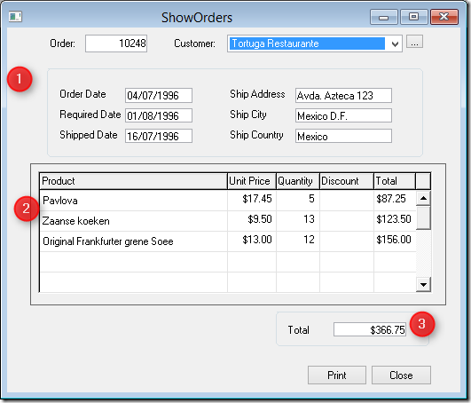
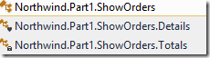
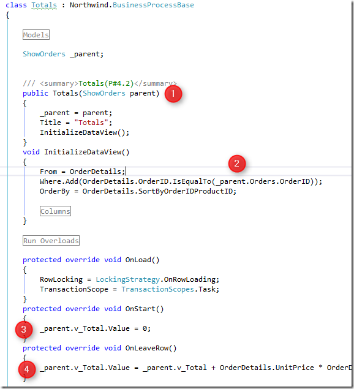

>This article focuses on making as few changes to the code as possible. There is a different approach that includes refactoring to remove dependency on the parent Controller at [reusing-an-inner-controller-class-from-another-controller.html](reusing-an-inner-controller-class-from-another-controller.html)

Some times we want to be able to run an inner class without calling it’s parent class, this usually happens when we are writing some code without any user interaction that want’s to reuse a code that used to be in a batch “SubTask” of an online task – and now it’s a BusinessProcess inner class of an outer UIContorller Class.

Let’s see a specific example.

In the Northwind application, we have a screen called “Show Orders”:

That screen is implemented by the following classes:  

1. Show Orders UIController class – which iterates the orders and shows the info at the top of the screen (marked as 1)
     1. Details UIController inner class – which displays the products in the order – (marked as 2)
     2. Totals BusinessProcess inner class – which calculates the order total that is displayed at the bottom right (makred as 3)  
 
In our case we want to call “Totals” inner class without a user to activate the parent “ShowOrders” screen.
For the sake of making it simple, we would like the user to type the following url “localhost/orders/total/10248” and get the result in the browser saying “The total of order 10248 is 366.75”

Let’s examine the Totals Inner Class:

We can see that the “Totals” inner class relies heavily on it’s parent class:

1. It receives it in it’s constructor
2. It filters the OrderDetails table according to the OrderID from the Orders entity used in the parent class.
3. It updated the column “v_Total” in the parent class to 0.
4. It updated the column “v_Total” with the current value.

