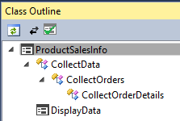
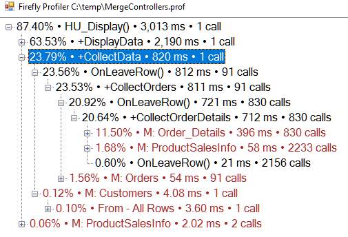

In this set of videos we take a deep inner controller tree and improve it's performance using joins and group by.

The scenario we've tested, which had 250,000 was taking one minute when we started.

Improving it with joins, reduced the time to 15 seconds.

Improving that with Group By reduced the time to 1/2 a second.

Here's the code of the controller before we optimize it. [ProductSalesInfo.zip](ProductSalesInfo.zip)

<iframe width="560" height="315" src="https://www.youtube.com/embed/Zx--di4qOeg?list=PL1DEQjXG2xnLp-A7typjUccfykKPenrer" frameborder="0" allowfullscreen></iframe>
---

## the profiler we used in this process

[Power Point slide used in this video](ProductSalesInfo.pptx)