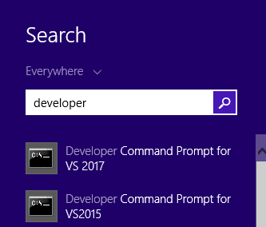

In many cases we have an XSD file that is provided to us by some 3rd party that dictates the structure of the xml file we need to read or create.

We want to be able to word with that xsd file from code, using classes as we've done so far.

To do that, we'll need to use the `xsd.exe` tool.
* Open the Windows Search bar, and search for "Developer"  


* Choose Developer Command Prompt for VS2017 (or VS2015)
* In the command line window, change the directory to the directory in which you have the Xsd file.
* Run the following command:
```
xsd.exe /c {xsdfilename.xsd} /n:{namespace for the classes}
```
In our example it is:
```
xsd.exe /c ShipOrder.xsd /n:Northwind.Training.DemoXsd
```

* This will create a file called ShipOrder.cs, drag and drop it into your folder in Visual Studio and use it just like any other POCO.
```csdiff
var x = Shared.XMLHelper.ReadXml<shiporder>(@"c:\temp\shiporder\shiporder.xml");
```


<iframe width="560" height="315" src="https://www.youtube.com/embed/BXL3cEzkFmU?list=PL1DEQjXG2xnIpyKeZmM66PL2bbuUyhyNE" frameborder="0" allowfullscreen></iframe>