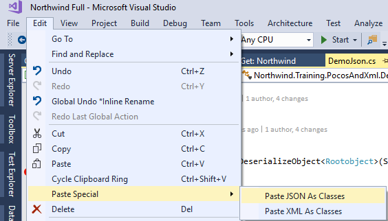

In many cases we have a JSON file from an external source that we would like to use.

The easiest way to use it, is to create classes based on it and read them.

Just Copy the JSON Data and choose the "Edit\Paste Special\Paste JSON As Classes" and that's it.

<iframe width="560" height="315" src="https://www.youtube.com/embed/b2kaJ-H78PY?list=PL1DEQjXG2xnIpyKeZmM66PL2bbuUyhyNE" frameborder="0" allowfullscreen></iframe>