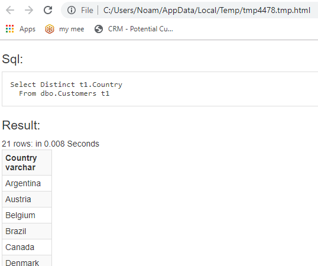

When you add the following using statements to your code, a `TestSql` extention method is added to every DataSource

```csdiff
using Firefly.Box;
+using static ENV.Utilities.EasySql;
+using ENV.Utilities.EasySqlExtentions;
...
static void MyTestMethod()
{
    var c = new Models.Customers();
    Select(Distinct(c.Country))
    .From(c)
+	.TestOn(Shared.DataSources.Northwind);
}
```

Running this code will open the browser with the Sql and it's result - giving you a responsive experiance, as if you were writing Sql in a regular sql editor

