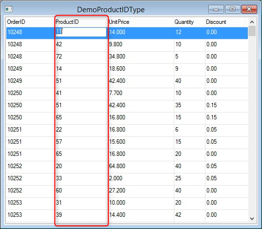

In this article we will improve the ProdID type, to show data from the Products table, when we use it in combo box.  

First we will create a new type "ProductID":


This is the code for the new type:

```csdiff
using System;
using System.Collections.Generic;
using System.Text;
using Firefly.Box;
using ENV.Data;

namespace Northwind.Types
{
    public class ProductID : NumberColumn
    {
        public ProductID() : base("ProductID", "N10")
        {
        }
    }
}
```

Now we will use it in the Order_Details table definition: 

```csdiff
using Firefly.Box;
using ENV.Data;
namespace Northwind.Models
{
    /// <summary>Order_Details(E#3)</summary>
    public class Order_Details : Entity 
    {
        #region Columns
        [PrimaryKey]
        public readonly Types.OrderID OrderID = new Types.OrderID { Caption = "OrderID", Name = "OrderID" };
        [PrimaryKey]
-       public readonly NumberColumn ProductID = new NumberColumn("ProductID", "N10");
+       public readonly Types.ProductID ProductID = new Types.ProductID();
        public readonly NumberColumn UnitPrice = new NumberColumn("UnitPrice", "10.3");
        public readonly NumberColumn Quantity = new NumberColumn("Quantity", "N5");
        public readonly NumberColumn Discount = new NumberColumn("Discount", "5.2");
        #endregion
        #region Indexes
        /// <summary>PK_Order_Details (#1)</summary>
        public readonly Index SortByPK_Order_Details = new Index { Caption = "PK_Order_Details", Name = "PK_Order_Details", AutoCreate = true, Unique = true };
        /// <summary>OrderID (#2)</summary>
        public readonly Index SortByOrderID = new Index { Caption = "OrderID", Name = "OrderID", AutoCreate = true };
        /// <summary>ProductID (#3)</summary>
        public readonly Index SortByProductID = new Index { Caption = "ProductID", Name = "ProductID", AutoCreate = true };
        #endregion
        public Order_Details() : base("dbo.[Order Details]", "Order_Details", Shared.DataSources.Northwind)
        {
            Cached = false;
            InitializeIndexes();
        }
        void InitializeIndexes()
        {
            SortByPK_Order_Details.Add(OrderID, ProductID);
            SortByOrderID.Add(OrderID);
            SortByProductID.Add(ProductID);
        }
    }
}
```

Next we need to add some new functionality to our combobox :


We will start with adding an interface
```csdiff
namespace Northwind.Shared.Theme.Controls
{
    public partial class ComboBox : ENV.UI.ComboBox 
    {
        /// <summary>ComboBox</summary>
        public ComboBox()
        {
            if (!DesignMode)
            	FixedBackColorInNonFlatStyles = ENV.UserSettings.FixedBackColorInNonFlatStyles;
            InitializeComponent();
        }
    }
+   public interface ICanConfigureCombo
+   {
+       void Configure(ComboBox c);
+   }
}

```

And now we will add the option to configure the combox using our new interface :  
 
```csdiff
namespace Northwind.Shared.Theme.Controls
{
    public partial class ComboBox : ENV.UI.ComboBox 
    {
        /// <summary>ComboBox</summary>
        public ComboBox()
        {
            if (!DesignMode)
            	FixedBackColorInNonFlatStyles = ENV.UserSettings.FixedBackColorInNonFlatStyles;
            InitializeComponent();
        }
    }
+   protected override void OnLoad()
+   {
+      if (Data != null)
+      {
+        var c = Data.Column as ICanConfigureCombo;
+        if (c != null)
+           {
+               c.Configure(this);
+           }
+       }
+           base.OnLoad();
+       }
+   }
    public interface ICanConfigureCombo {
        void Configure(ComboBox c);
    }
}

```

Now we implement the ComboBox "ICanConfigureCombo" interface in the "ProductId" type:

```csdiff

using System;
using System.Collections.Generic;
using System.Text;
using Firefly.Box;
using ENV.Data;
using Northwind.Shared.Theme.Controls;

namespace Northwind.Types
{
-   public class ProductID : NumberColumn
+   public class ProductID : NumberColumn , Shared.Theme.Controls.ICanConfigureCombo
    {
        public ProductID() : base("ProductID", "N10")
        {
            ControlType = typeof(Shared.Theme.Controls.ComboBox);
        }

+       public void Configure(ComboBox c)
+       {
+           throw new NotImplementedException();
+       }
    }
}

```

Now we will change the code from throwing NotImplementedException to some reasonable code, that will populate the combobox with values from the Products table.

```csdiff

using System;
using System.Collections.Generic;
using System.Text;
using Firefly.Box;
using ENV.Data;
using Northwind.Shared.Theme.Controls;

namespace Northwind.Types
{
    public class ProductID : NumberColumn , Shared.Theme.Controls.ICanConfigureCombo
    {
        public ProductID() : base("ProductID", "N10")
        {
            ControlType = typeof(Shared.Theme.Controls.ComboBox);
        }

        public void Configure(ComboBox c)
        {
-           throw new NotImplementedException();
+           var p = new Models.Products();
+           c.ListSource = p;
+           c.DisplayColumn = p.ProductName;
+           c.ValueColumn = p.ProductID;
+       }
    }
}

```

At this point adding the ProductID column to a UIController will result in a regular column :



But if we change the TextBox to ComboBox you will get ComboBox that allow you to select from list of products:


You can also create a combo box builder class and enjoy it:

```csdiff
class ComboBuilder
{
    string comboValues = "", comboDisplayValues = "";
    public void PopulateComboBox(ENV.UI.ComboBox c)
    {

        c.Values = comboValues;
        c.DisplayValues = comboDisplayValues;

    }
    public void AddValue(Number key, Text value)
    {
        if (comboValues != "")
        {
            comboValues += ",";
            comboDisplayValues += ",";
        }
        comboValues += key.ToString().Trim();
        comboDisplayValues += value.Trim().Replace("-", "\\-");
    }
}
```

