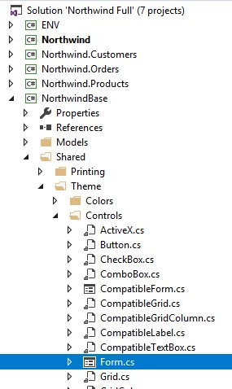
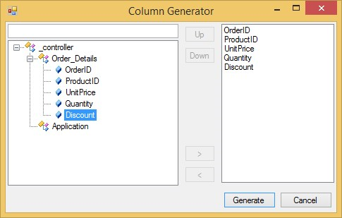
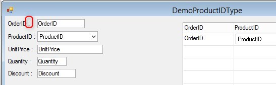
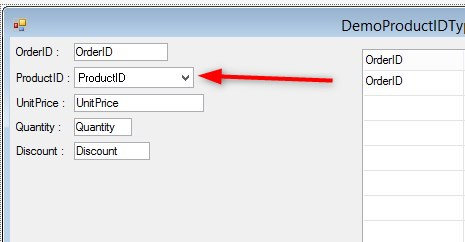
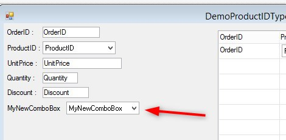



We start by setting up our form object the root of all forms:



We will override the 'AfterWizardAddedControl' method

```csdiff
using Firefly.Box.Data.Advanced;
using Firefly.Box.UI;
using Firefly.Box.UI.Advanced;

namespace Northwind.Shared.Theme.Controls
{
    public partial class Form : ENV.UI.Form 
    {
        /// <summary>Form</summary>
        public Form()
        {
            Icon = ENV.Common.DefaultIcon;
            DefaultLabelType = typeof(Label);
            DefaultTextBoxType = typeof(TextBox);
            InitializeComponent();
        }
+       public override void AfterWizardAddedControl(Firefly.Box.UI.Label label, InputControlBase control, ColumnBase column)
+       {
+           base.AfterWizardAddedControl(label, control, column);
+       }
    }
}
```

This method allow us to take more control on how the items we are adding to the form are going to look or behave:
I.E. If I will like all labels to have a suffix of ':' , I can add that here:

```csdiff
using Firefly.Box.Data.Advanced;
using Firefly.Box.UI;
using Firefly.Box.UI.Advanced;

namespace Northwind.Shared.Theme.Controls
{
    public partial class Form : ENV.UI.Form 
    {
        /// <summary>Form</summary>
        public Form()
        {
            Icon = ENV.Common.DefaultIcon;
            DefaultLabelType = typeof(Label);
            DefaultTextBoxType = typeof(TextBox);
            InitializeComponent();
        }
        public override void AfterWizardAddedControl(Firefly.Box.UI.Label label, InputControlBase control, ColumnBase column)
        {
+           label.Text += " :";
            base.AfterWizardAddedControl(label, control, column);
        }
    }
}
```

Now when I use the columnWizard to add columns the end result will be:




Also notice that our product Id column was add as comboBox:




### Set a local column to be comboBox

Just add a local column to your controller and set the ControlType to be typeof comboBox, this is a new option that you may not have.

```csdiff
using System;
using System.Collections.Generic;
using System.Text;
using System.Drawing;
using Firefly.Box;
using ENV;
using ENV.Data;

namespace Northwind
{
    public class DemoProductIDType : UIControllerBase
    {
        

        public readonly Models.Order_Details Order_Details = new Models.Order_Details();

+       public readonly NumberColumn MyNewComboBox = new NumberColumn() { ControlType = typeof(Shared.Theme.Controls.ComboBox)};

        public DemoProductIDType()
        {
            From = Order_Details;
        }

        public void Run()
        {
            Execute();
        }

        protected override void OnLoad()
        {
            View = () => new Views.DemoProductIDTypeView(this);
        }
    }
}
```

When you add this column to the form using the columnWizard it will show up as comboBox 

