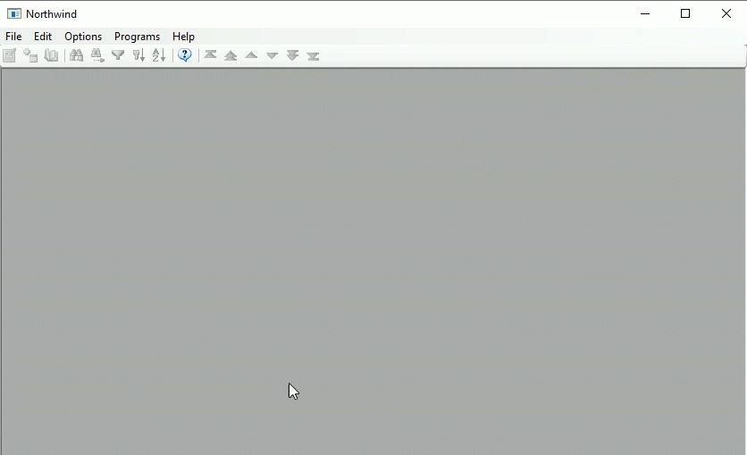

When using the EnhancedGridFeatures you can add your own filter options to the grid column, and make them on or off by default.

Here's an example of how it works



Here is an example of how to use it:
```csdiff
 partial class ShowCustomersView : Shared.Theme.Controls.CompatibleForm 
{
    ShowCustomers _controller;
    internal ShowCustomersView(ShowCustomers controller)
    {
        _controller = controller;
        InitializeComponent();
+       gclCity.AddFilterOption("London", _controller.Customers.City.IsEqualTo("London"), true);
+       gclCity.AddFilterOption("Berlin", _controller.Customers.City.IsEqualTo("Berlin"), false);
    }
}
```


## How to add it to older versions of ENV
In the `GridColumn.cs` file, add the following code:
```csdiff
using ENV.Labs;
+using Firefly.Box.Data.Advanced;
using Firefly.Box.UI;

...

public class GridColumn : Firefly.Box.UI.GridColumn
{
    public GridColumn()
    {

    }

+   protected override string Translate(string term)
+   {
+       return base.Translate(ENV.Languages.Translate(term));
+   }
+   public void AddFilterOption(string name, FilterBase where, bool defaultActive = false)
+   {
+       AddFilterOption(name, () => where, defaultActive);
+   }
+   public void AddFilterOption(string name, Func<FilterBase> where, bool defaultActive = false)
+   {
+       _filterOptions.Add(new FilterOption(name, where, defaultActive));
+   }
+   List<FilterOption> _filterOptions = new List<FilterOption>();
+   class FilterOption
+   {
+       private string _name;
+       private Func<FilterBase> _where;
+       private bool _defaultActive;
+
+       public FilterOption(string name, Func<FilterBase> where, bool defaultActive)
+       {
+           _name = name;
+           _where = where;
+           _defaultActive = defaultActive;
+       }
+
+       internal void Apply(Action<string, Func<FilterBase>, bool> add)
+       {
+           add(_name, _where, _defaultActive);
+       }
+   }
+
+   internal void ProvideFilterOptionsTo(Action<string, Func<FilterBase>, bool> add)
+   {
+       foreach (var item in _filterOptions)
+       {
+           item.Apply(add);
+       }
+   }

    public override Firefly.Box.UI.FontScheme FontScheme
    {
```

In the `Grid.cs` file make the following changes to the `ColumnHelper` class:
1. Change the `AddFilterOption`:
```csdiff
-void AddFilterOption(string name, Func<UIController, FilterBase> createFilter)
+void AddFilterOption(string name, Func<UIController, FilterBase> createFilter, bool defaultOn = false)
{
    var item = new ToolStripMenuItem(name);
    _cm.Items.Add(item);
+   if (defaultOn)
+   {
+       DoOnCurrentUIController((uic) =>
+       {
+
+           var f = createFilter(uic);
+           if (f != null)
+           {
+               _applyFilter = y => y.Add(f);
+               foreach (var i in _cm.Items)
+               {
+                   var m = i as ToolStripMenuItem;
+                   if (m != null)
+                       m.Checked = false;
+               }
+               item.Checked = true;
+               _gridColumn.HeaderButton.Pinned = true;
+           }
+           if (df == null)
+           {
+               df = new DynamicFilter(z =>
+               {
+                   _applyFilter(z);
+               });
+               uic.Where.Add(df);
+           }
+       }, _gridColumn);
+   }
    item.Click +=
        delegate
        {
            ENV.Common.RunOnLogicContext(_gridColumn,
                () =>
...
```
2. In the `Init` method  of the `ColumnHelper` class add the following call
```csdiff
 public void Init()
{
    if (_col != null)
        return;
    InputControlBase icb=null;
    foreach (var control in _gridColumn.Controls)
    {
        icb = control as Firefly.Box.UI.Advanced.InputControlBase;
        if (icb != null)
        {
            var col = Common.GetColumn(icb);
            if (col != null)
            {
                _col = col;

            }
        }
    }
+   _gridColumn.ProvideFilterOptionsTo((name, filter, defaultOn) => AddFilterOption(name, c => filter(), defaultOn));

    if (_col == null)
        return;
		....
```