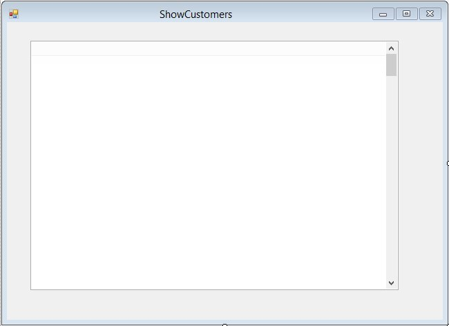
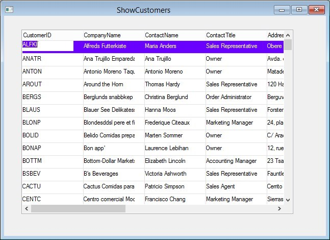

keywords: designer, form, view, dynamic, screen, columns

# Adding all the columns of the entity

An entity (table) is actually a collection of columns - so by using a ```foreach``` loop, we can add all the columns to the grid.

```csdiff

partial class ShowView : Shared.Theme.Controls.Form
{
    ShowCustomers _controller;
    public ShowView(ShowCustomers controller)
    {
        _controller = controller;
        InitializeComponent();
-       AddColumn(_controller.Customers.City);
+       foreach (var col in _controller.Customers.Columns)
+       {
+           AddColumn(col);
+       }

    }

    void AddColumn(ColumnBase colToAdd)
    {
        var gcCity = new Shared.Theme.Controls.GridColumn() { Text = colToAdd.Caption };
        var tbCity = new Shared.Theme.Controls.TextBox() { Style = Firefly.Box.UI.ControlStyle.Flat };
        tbCity.Data = colToAdd;
        gcCity.Controls.Add(tbCity);
        grid1.Controls.Add(gcCity);
    }
}
```

So even if my view looks like this:  


The result will look like this:  


As you can see, each column has the same width.  
The next article will use the ```AddColumn``` method to control the width of each column.