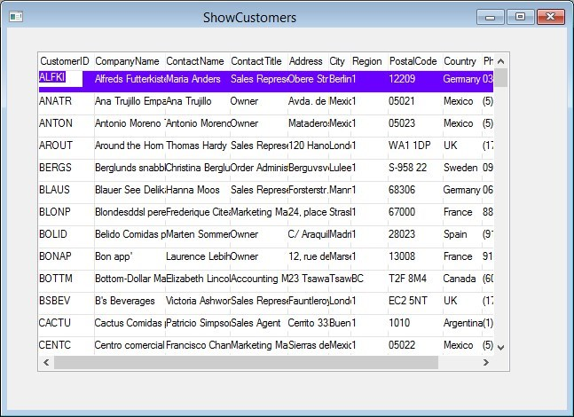

keywords: designer, form, view, dynamic, screen

# Controlling the width of a column

Each column has its own width - we can use it to control the width of the columns on the grid.

```csdiff

partial class ShowView : Shared.Theme.Controls.Form
{
    ShowCustomers _controller;
    public ShowView(ShowCustomers controller)
    {
        _controller = controller;
        InitializeComponent();
        foreach (var col in _controller.Customers.Columns)
        {
           AddColumn(col);
        }
    }

    void AddColumn(ColumnBase colToAdd)
    {
        var gcCity = new Shared.Theme.Controls.GridColumn() { Text = colToAdd.Caption };
        var tbCity = new Shared.Theme.Controls.TextBox() { Style = Firefly.Box.UI.ControlStyle.Flat };
        tbCity.Data = colToAdd;
+       int width = colToAdd.FormatInfo.MaxLength;
+       if (width < 5)
+           width = 5;
+       if (width > 25)
+           width = 25;
+       tbCity.ResizeToFit(width);
+       gcCity.ResizeToFitContent();
        gcCity.Controls.Add(tbCity);
        grid1.Controls.Add(gcCity);
    }
}
```
The result will look like this:  


As you can see, each column has the same width.  
The next article will prepae the view for a general use by other controllers.