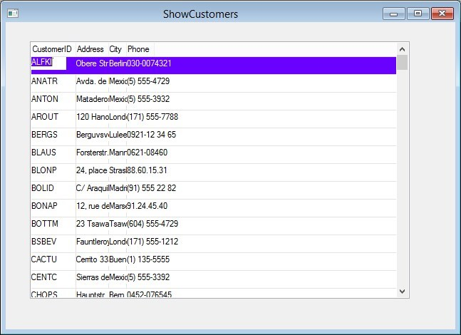

keywords: designer, form, view, dynamic, screen

# Prepare the view for a general use 

Let's modify our view code so any controller can use it.
First let's create an ```AddColumns``` method that receives an array of columns and calls the ```AddColumn``` method for each column:

```csdiff

partial class ShowView : Shared.Theme.Controls.Form
{
-   ShowCustomers _controller;
-   public ShowView(ShowCustomers controller)
+   public ShowView()
    {
-       _controller = controller;
        InitializeComponent();
-       foreach (var col in _controller.Customers.Columns)
-       {
-          AddColumn(col);
-       }
    }
+   public void AddColumns(prams ColumnBase [] columns)
+   {
+       foreach (var col in columns)
+       {
+           AddColumn(col);
+       }
+   }

}
```

Now we need to modify the controller's code, so it would use this view and the ```AddColumns``` method:
```csdiff
    protected override void OnLoad()
    {
-       View = () => new Views.ShowView(this);
+       View = () =>
+       {
+           var view = new Views.ShowView();
+           view.AddColumns(Customers.CustomerID, Customers.Address, Customers.City, Customers.Phone);
+           return view;
+       };   
}
```
The result will look like this:  


> As we did in the previous example, you can use the ```foreach``` loop to add all the columns.

So now, adding a new controller with no view, that will use our existing view in the same manner, is easy. 
The next article will show it.
