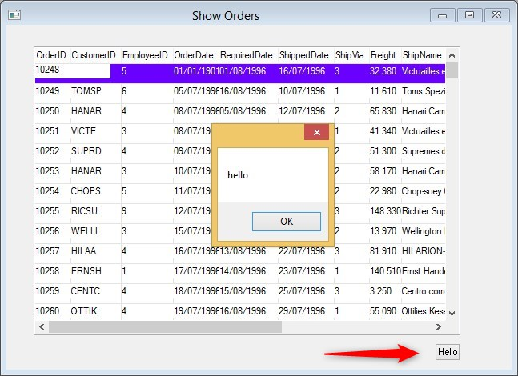

keywords: designer, form, view, dynamic, screen, action

# Adding an action to the view

We can add additional methods to our generic view and use them whenever we need to.
Lets add a push button that does something.

In the view we need to add the new method:
```
public void AddAction(string caption, Action whatToDo)
{
    var pb = new Shared.Theme.Controls.Button()
    {
        Text = caption
    };
    pb.ResizeToFit(caption);
    pb.Click += (sender, e) => whatToDo();
    Controls.Add(pb);
    pb.Left = grid1.Right - pb.Width;
    pb.Top = grid1.Bottom + 10;
}
```

Lets call the new method from the controller:
```csdiff
    View = () =>
    {
        var view = new Views.ShowView() { Text = "Show Orders" };
        foreach (var col in Orders.Columns)
        {
            view.AddColumns(col);
        }
+       view.AddAction("Hello", ()=>System.Windows.Forms.MessageBox.Show("hello"));
        return view;
    };

```
The result looks like this:  


The next article will show a built-in utilty you can use that does exactly that.