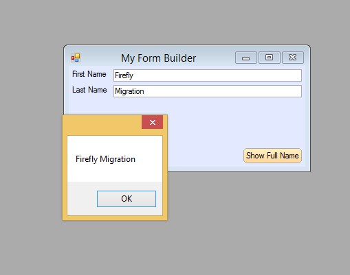

keywords: designer, form, view, dynamic, screen, formbuilder

# Using the FormBuilder

You can use a built-in utility called FormBuilder that performs as a general view.  
Lets use it:

```
    var firstName = new TextColumn("First Name", "30");
    var lastName = new TextColumn("Last Name", "30");

    var fb = new ENV.UI.FormBuilder("My Form Builder");
    fb.AddColumn(firstName);
    fb.AddColumn(lastName);
    fb.AddAction("Show Full Name", () => System.Windows.Forms.MessageBox.Show(firstName.Trim()+ " " + lastName.Trim()));
    fb.Run();

```
The result looks like this:  


Enjoy :-)