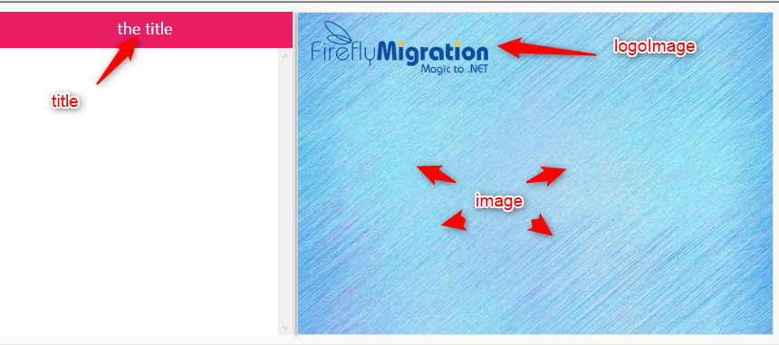

In this article we'll explain how you can add the WPF menu to an existing application.

First, please download the latest version of `Firefly.Wpf.MenuDemo.exe` from [Github](https://github.com/FireflyMigration/WpfMenuDemo/releases) and add a reference to it in your project.


First let's start by calling the `WPF` menu to make sure that it works:
```csdiff
Firefly.Wpf.MenuDemo.WpfMenu.Run(
    addRootMenu =>
    {
    },
    title: "the title",
    image: @"c:\temp\backgroundImage.jpg",
    logoImage: @"c:\temp\logo-big.jpg"
    );
```

It recieves several parameters:
1. `addItems` - used to add items to the menu, we'll discuss it in depth soon.
2. `title` - the text title that'll be displayed in the menu
3. `image` - the background image that will be displayed in the menu
4. `logoImage` - a smaller image that'll be displayed at the to of the menu.




### Using Logical Names for the Images
To translate logical names, user the `PathDecoder.Decode` method.
```csdiff
Firefly.Wpf.MenuDemo.WpfMenu.Run(
    addRootMenu =>
    {
    },
    title: "the title",
-    image: @"c:\temp\backgroundImage.jpg",
-    logoImage: @"c:\temp\logo-big.jpg"
+    image: PathDecoder.DecodePath(@"%Images%backgroundImage.jpg"),
+    logoImage: PathDecoder.DecodePath(@"%Images%logo-big.png")
    );
```

### Loading items into the menu root
The WPF menu can hold 3 generations of menus (if you want more, download the source code from [github](https://github.com/FireflyMigration/WpfMenuDemo/tree/material-design) and change it)

Adding root menus is done by calling the `addRootMenu` method that was recieved in the first parameter.
```csdiff
Firefly.Wpf.MenuDemo.WpfMenu.Run(
    addRootMenu =>
    {
+        addRootMenu("Show Orders",
+            () => new ShowOrders().Run(),
+            addSecondLevelMenu =>
+            {
+            });
    },
    title: "the title",
    image: PathDecoder.DecodePath(@"%Images%backgroundImage.jpg"),
    logoImage: PathDecoder.DecodePath(@"%Images%logo-big.png")
    );
```
This method recieves 3 parameters:
1. Menu's text
2. An Action to be called when the menu is clicked - send null if the menu is not clickable.
3. addItems - a method that is used to add child menus to this specific root menu.

### Loading second level items
Simpy call the `addSecindLevelMenu` from within the scope (curley brackets) of the first menu
```csdiff
Firefly.Wpf.MenuDemo.WpfMenu.Run(
    addRootMenu =>
    {
        addRootMenu("Show Orders",
            () => new ShowOrders().Run(),
            addSecondLevelMenu =>
            {
+               addSecondLevelMenu("second level child menu", null,
+                   addThirdLevelMenu =>
+                   {
+
+                   });
            });
    },
    title: "the title",
    image: PathDecoder.DecodePath(@"%Images%backgroundImage.jpg"),
    logoImage: PathDecoder.DecodePath(@"%Images%logo-big.png")
    );
```

The `addSecondLevelMenu` method recieves the same parameters as the `addRootMenu`

### Loading third level items
I'm guessing you get the picture by now, it's pretty similar, only in a third level item, you only send two parameters as we only support 3 hirarchies at this time.
```csdiff
Firefly.Wpf.MenuDemo.WpfMenu.Run(
    addRootMenu =>
    {
        addRootMenu("Show Orders",
            () => new ShowOrders().Run(),
            addSecondLevelMenu =>
            {
                addSecondLevelMenu("second level child menu", null,
                    addThirdLevelMenu =>
                    {
+                       addThirdLevelMenu("My Third level menu", ()=>MessageBox.Show("Click"));
                    });
            });
    },
    title: "the title",
    image: PathDecoder.DecodePath(@"%Images%backgroundImage.jpg"),
    logoImage: PathDecoder.DecodePath(@"%Images%logo-big.png")
    );
```

### Loading menues from a the database
To demo this, I'll create a menu that has customers in the first level, and Orders in the second level, so when you click on an Order it get's printed.
Not realistic but it explains the point :)

Let's start with the previous code sample. Instead of adding the root menu hard coded - we'll use the customers table for this.
```csdiff
Firefly.Wpf.MenuDemo.WpfMenu.Run(
    addRootMenu =>
    {
        addRootMenu("Show Orders",
            () => new ShowOrders().Run(),
            addSecondLevelMenu =>
            {
            });
+       var c = new Models.Customers();
+       c.ForEachRow(() =>
+       {
+           addRootMenu(c.CompanyName.Value.Trim(),
+               null,
                addSecondLevelMenu =>
                {
                    addSecondLevelMenu("second level child menu", null,
                        addThirdLevelMenu =>
                        {
                        });
                });
+       });
    },
    title: "the title",
    image: PathDecoder.DecodePath(@"%Images%backgroundImage.jpg"),
    logoImage: PathDecoder.DecodePath(@"%Images%logo-big.png")
    );
```

Next let's get the orders of each customer and place it in a sub menu:
```csdiff
Firefly.Wpf.MenuDemo.WpfMenu.Run(
    addRootMenu =>
    {
        addRootMenu("Show Orders",
            () => new ShowOrders().Run(),
            addSecondLevelMenu =>
            { 
            });
        var c = new Models.Customers();
        c.ForEachRow(() =>
        {
            addRootMenu(c.CompanyName.Value.Trim(),
                null,
                addSecondLevelMenu =>
                {
-                   addSecondLevelMenu("second level child menu", null,
+                   var o = new Models.Orders();
+                   o.ForEachRow(o.CustomerID.IsEqualTo(c.CustomerID), () =>
+                   {
+                       addSecondLevelMenu("Order: " + o.OrderID.ToString().Trim(),
+                           null,
                            addThirdLevelMenu =>
                            {
                            });
+                   });
                });
        });
    },
    title: "the title",
    image: PathDecoder.DecodePath(@"%Images%backgroundImage.jpg"),
    logoImage: PathDecoder.DecodePath(@"%Images%logo-big.png")
    );
```

### Calling a Controller from the Menu

```csdiff
 Firefly.Wpf.MenuDemo.WpfMenu.Run(
    addRootMenu =>
    {
        addRootMenu("Show Orders",
            () => new ShowOrders().Run(),
        addSecondLevelMenu =>
        {
        });
            var c = new Models.Customers();
            c.ForEachRow(() =>
            {
                addRootMenu(c.CompanyName.Value.Trim(),
                    null,
                    addSecondLevelMenu =>
                    {
                        var o = new Models.Orders();
                        o.ForEachRow(o.CustomerID.IsEqualTo(c.CustomerID), () =>
                        {
+                           var orderId = o.OrderID.Value;// We need to remember the specific order id to later use it when we call the controller
                            addSecondLevelMenu("Order: " + o.OrderID.ToString().Trim(),
-                               null,
+                               () => new Print_Order().Run(orderId),
                                addThirdLevelMenu =>
                                {
                                });
                        });
                    });
            });
        },
    title: "the title",
    image: PathDecoder.DecodePath(@"%Images%backgroundImage.jpg"),
    logoImage: PathDecoder.DecodePath(@"%Images%logo-big.png")
    );
```

* note that in line 19 we are storing the `OrderId` of the specific order that we later want to print. If we do not do that - whenever we'll print it'll print the last order id.