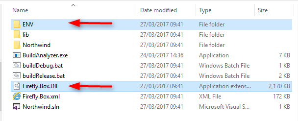

keywords:latest, new, env, firefly, final migration

In some cases the migration engine involves also the changes in the application code,   
so copying the *ENV* folder and *Firefly.Box.Dll* is not enough and you also need to merge the new migrated code with your code. 

In order to do that you need to:

1. Open the AutomaticMigration folder and launch a new migration (Change the name of Start.Done file to Start)  
2. When the migration finished download the .rar file into a temporary folder  
3. Extract it and rename the folder to [appname]_**new**  
4. Go back to the AutomaticMigration folder, migrate to an older version of Firefly (before the fix).   
   You may do so by changing the "Start.Done" to "Start.[version number]" (E.g "Start.26175").  
5. Download the .rar file into a temporary folder  
6. Extract it and rename the folder to [appname]_**old**  
7. Compare the old folder and the new folder (you can use Beyond Compare)  

  

8. Merge only the differences with your code (ignore the ENV code)
9. Copy ENV folder + Firefly.Box.Dll into your code folder   

  

10- Run buildDebug.bat  

---

