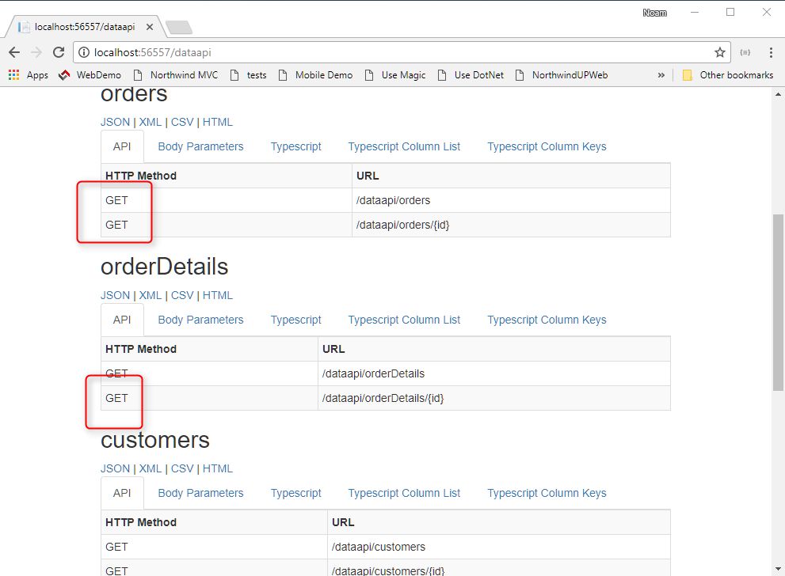
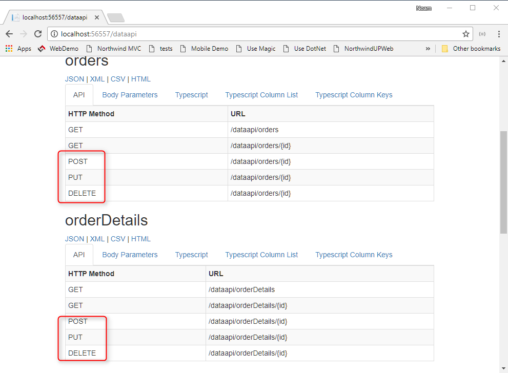

Currently our Rest API is readonly, as it only support get operations for Orders and orderDetails:



To change that we'll instruct the DataApi to make then public.

In the `Controllers\DataApiController.cs` file, we'll send `true` to the last parameter of the `Register` method, which is called:`allowInsertUpdateDelete`
```csdiff
static DataApiController()
{
    _dataApi.Register(typeof(Northwind.Models.Categories),true);
-   _dataApi.Register(typeof(Northwind.Models.Orders));
+   _dataApi.Register(typeof(Northwind.Models.Orders),true);
-   _dataApi.Register("orderDetails",typeof(Northwind.Models.Order_Details));
+   _dataApi.Register("orderDetails",typeof(Northwind.Models.Order_Details),true);
    _dataApi.Register(typeof(Northwind.Models.Customers));
    _dataApi.Register(typeof(Northwind.Models.Shippers));
    _dataApi.Register(typeof(Northwind.Models.Products));

```

Now when we'll refresh the dataApi help page we'll see that the API current support also, Post, Put and Delete



Now when we'll update data using the application, that data will be saved to the server.